# TACO Finance App Recipe: Client Application

## Introduction

The TACO Finance App Recipe client application is a sample mobile app that exposes capabilities a typical financial advisor might need when away from the office. The application was created to highlight best practices for developing mobile applications using Visual Studio, Apache Cordova and Ionic 2, while addressing the following: 

+ **Authentication & authorization**
+ **Secure communication** between client and server
+ **Secure local storage**
+ **Offline synchronization of data**
+ **Visualization of data** using graphs and/or charts
 
### Client Capabilities

The mobile application enables investment managers to manage the following client-related content while away from the office: 

+ **Clients**: View a list of Clients plus add, edit and delete Client records.
+ **Accounts**: For each client, view a list of Accounts plus add, edit and delete client Account records. 
+ **Investments**: For each Account, view a list of Investments plus add, edit and delete Investment records.
+ **Research**: Lookup company stock information such as current price, high, and low values. Graph performance data over time and add alerts for selected stocks.
+ **Alerts**: Enables application users to configure the application to notify them when specific stock values increase or decrease beyond thresholds. Alerts utilize [Azure Functions](https://azure.microsoft.com/en-us/services/functions/) and the [Azure Notification Hub](https://azure.microsoft.com/en-us/services/notification-hubs/) to manage processing and delivery of alerts to the user's mobile device.
	> **Note:** The alerts capabilities of the application are only available when the application is operated in online mode; see below.  

### Data Access Mechanisms 

The application supports multiple data access mechanisms: 

+ **Online**: Application data is maintained in an online application hosted in the [Azure Mobile App Service](https://azure.microsoft.com/en-us/services/app-service/mobile/). The cloud-based app hosts application in four Easy tables: Accounts, Alerts, Clients, and Investments. The Azure mobile app exposes authentication services to the app through Azure Active Directory.
+ **Offline**: The same Azure Mobile app that provides cloud-based storage for the application, can be used to enable data synchronization capabilities as well. Offline mode directs the application to read and write directly to a local data store, then the Azure Mobile app client libraries manage synchronizing updates with the cloud repositories.
+ **Local storage**: Application data is stored in local repositories using the JavaScript localstorage APIs. This option enables the application to run in the browser (for testing purposes) and is suitable for demonstrating the app, not production use. 
	>**Note:** With the application configured for local storage and running on a mobile device in the Cordova container, the Ionic Storage component intercepts API requests and writes data to a local SQL database (sqlite).
+ **Secure Storage**: This option is the same as the local storage option, except that application date is stored locally in encrypted format using the [Ionic Secure Storage](https://ionicframework.com/docs/v2/native/secure-storage/) component and the Cordova [Secure Storage](https://github.com/Crypho/cordova-plugin-secure-storage) plugin. Data is read from and written to a local secure repository and is suitable for demonstrating the app, not necessarily production use.  
  
### Client Technologies

The client application project was built using [Microsoft Visual Studio 2017](https://www.visualstudio.com/vs/) and Visual Studio [Tools for Apache Cordova](https://taco.visualstudio.com/), and makes use of the following technologies: 

+ [**Apache Cordova 6.x**](http://cordova.apache.org/)
+ [**Ionic 2**](https://ionicframework.com/) which, under the covers, uses [**Angular 2**](https://angular.io/)
+ [**D3**](https://d3js.org/) (charting stock performance data)

### Server Technologies

On the back-end, the application makes use of several Microsoft cloud services to deliver capabilities in the mobile app:

+ [**Azure Active Directory**](https://www.microsoft.com/en-us/cloud-platform/azure-active-directory) - Provides a cloud-based implementation of Microsoft Active Directory that application uses to authenticate users. 
+ [**Azure Functions**](https://azure.microsoft.com/en-us/services/functions/) - Manages the alerting capabilities of the app. The app's Azure functions read the Azure Mobile App's Alerts table, then checks stock prices against alert trigger thresholds. When a threshold has been exceeded, notifications are sent using the Azure Notification Hub.
+ [**Azure Mobile App Service**](https://azure.microsoft.com/en-us/services/app-service/mobile/) - Provides authentication services for the mobile application, data storage (using Azure Easy tables) and data synchronization (using offline data sync). 
+ [**Azure Notification Hub**](https://azure.microsoft.com/en-us/services/notification-hubs/) - Manages delivery of alert notifications to the mobile app.
+ [**Microsoft Code Push**](https://microsoft.github.io/code-push/) - Delivers application code updates over the air (OTA).
 
### Data Security

When in online mode, no data is stored locally, everything is retrieved directly from the server across a secure (HTTPS) connection. In offline mode, the Azure Mobile Services library stores all data in an encrypted local store. The localstorage option stores application data in human readable format, so should not be used in production environments.

## Client Application Screen Flow

The following figure highlights the client application's screen (page) flow. When the application's is configured for online mode, the user must successfully login to Active Directory (running in the Azure cloud environment) in order to access any of the application's capabilities. For the local and secure storage options, the application launches to the Client List page.   

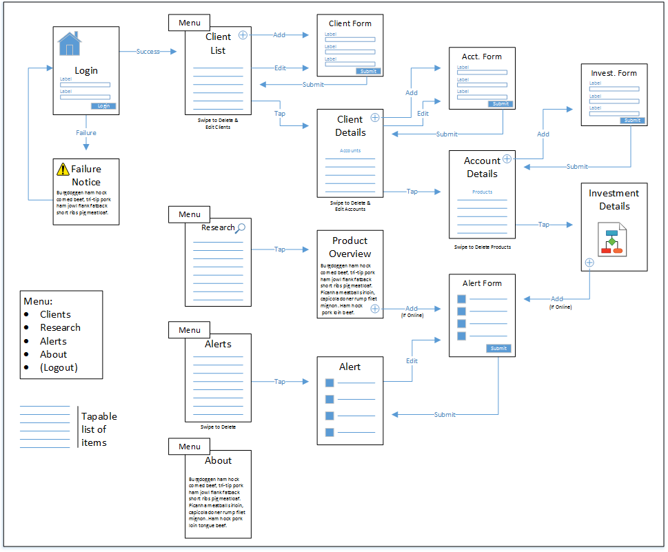

The following sections describe the application's capabilities in detail.

### Data Storage Settings

The application's data access mechanism is controlled through the application's **Settings** page. To access this page, open the application to the **Client List** page and click the settings icon in the toolbar. 

> **Note**: The icon image and icon location will differ depending on the target mobile platform.

The following figure highlights the settings page from the Android version of the application. Select the appropriate setting for your needs, then tap the **DONE** button to save your changes.

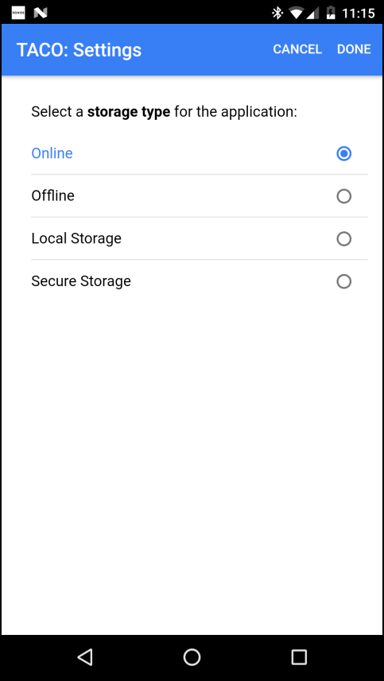

When the storage type changes, the application will reset its pointer to its data and reload the **Client List** page. If online is selected, the user must login to the application to access any of the data.

The application defaults to the **local storage** option, to change the default option, open the project's `FinanceAppIonic\src\providers\config.ts` file and change the `defaultStorageType` value:

	//Storage types
	public defaultStorageType = 'localstorage'; 

The supported options for this variable are:

+ `localstorage`
+ `offline`
+ `online`
+ `securestorage`

> **Note**: If you enable the Online option, but the application is running in the browser, or running in a Cordova client without the Microsoft Azure Mobile app plugin added, the application will revert to local storage mode.

### Login

When Online access is enabled, the application forces the user to complete the login process before he or she can access any of the application's data. The following figure shows the application's **Start** page, where the login process is initiated. 

To change any of the content on the login page, edit the `FinanceAppIonic\src\pages\start\start.html` file. The page must expose a button that executes the login code, so be sure to leave the button in place when you make your edits.  

### Client List

The starting point for the application (once logged in, as needed) is the **Client List** page shown in the following figure. From this page, you can:

+ **View Client details** - Tap on an item in the list to view detailed information about the selected Client.
+ **Add new Client records** - Tap the + icon in the lower-right corner of the page to add a new Client record.
+ **Edit Client records** - Swipe a client to the left to open the menu, and then tap **Edit** to edit the selected Client record. 
+ **Delete Client records** - Swipe a client to the left to open the menu, and then tap **Delete** to delete the selected Client record.
+ **Filter the Client list** using the **Search bar**
+ **Change application settings** - Tap the gear icon in the toolbar to open the application's **Settings** page.

> **Note**: All names listed are fictitious. No identification with actual persons (living or deceased) should be inferred. :-)

When you open a client record for viewing, you'll see a page similar to the one shown below. From here, you can view client information, you cannot edit or delete client records from this page. On the page: 

+ Tap the client's email to **send an email** message to the client's email address. 
+ Tap a phone number to **place a call** to the client's phone. 
+ If the client's physical address fields are populated (the Address, City, State and Zip fields), tap the location button in the toolbar to **open a map** to the client's address.

A client can be associated with multiple accounts, tap the **ACCOUNTS` tab on the top of the page to view account information (described in the following section).

### Account Details

The **Accounts** tab of the **Client Detail** page displays a list of accounts associated with the selected Client as shown in the following figure.  From this page, you can:

+ **View Account details** - Tap on an item in the list to view detailed information about the selected account.
+ **Add new Account records** - Tap the + icon in the lower-right corner of the page to add a new account record to the Client.
+ **Edit Account records** - Swipe an Account to the left to open the menu, and then tap **Edit** to edit the selected Account record. 
+ **Delete Account records** - Swipe an Account to the left to open the menu, and then tap **Delete** to delete the selected Account record.

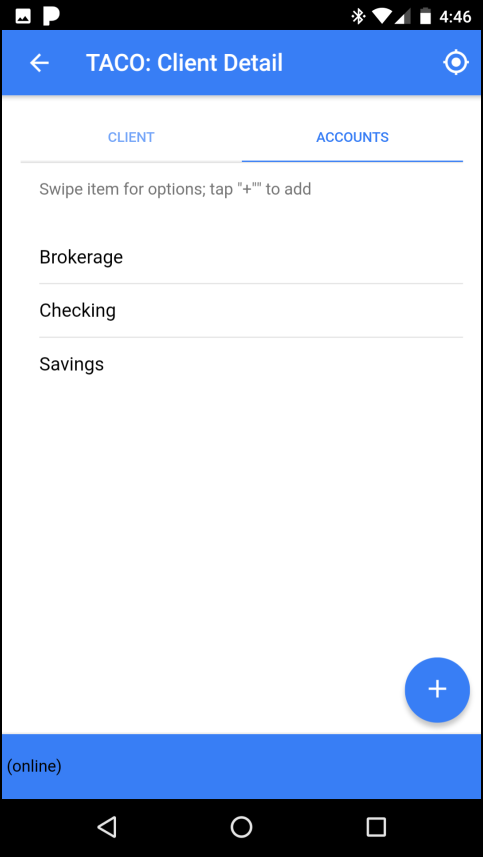

The following figure shows the Account form; you'll see this page whenever you add a new Account or edit an existing Account record. 

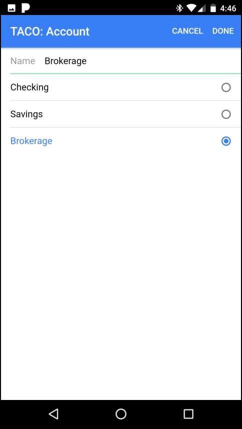

The following figure shows the Account details page; this page lists the **Account name** and **Account type**, then lists all of the **Investments** associated with the Account. 

An Account can have multiple Investments; these are described in the following section.

### Investment Details

When you tap on an Account from the Account Detail page, You'll see a page that  From this page, you can:

+ **View Investment details** - Tap on an item in the list to view detailed information about the selected Investment.
+ **Add new Investments** - Tap the + icon in the lower-right corner of the page to add a new Investment record to the Account.
+ **Delete Investment records** - Swipe an Investment to the left to open the menu, and then tap **Delete** to delete the selected Investment.

When you view Investment details, you'll see stock price and performance data as shown in the following figure (`NOT IMPLEMENTED YET`).
 
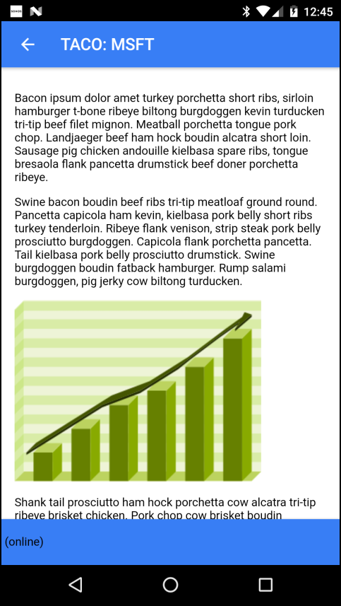

When adding an Investment, you'll populate the form shown in the following figure. 

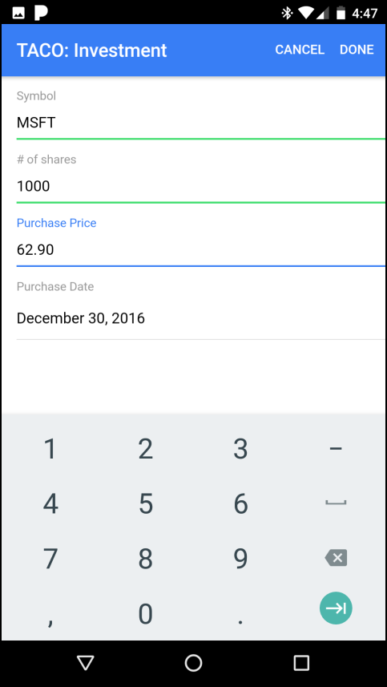

> **Note**: The application does not currently support editing Investments.

### Research

The **Research** area of the site enables application users to search for information on companies, view stock performance data and create alerts. Use the application menu to access the Research area of the app; tap the menu button in the upper-left corner of the application window to open the menu.

When the Research page opens, use the Search box to enter the name of the company you're interested in researching. Tap the **Search** button to begin the search. The application will display a list of public companies that meet the search criteria as shown in the following figure.  The **TOPICS** tab on the page displays static information about stocks and stock research.     

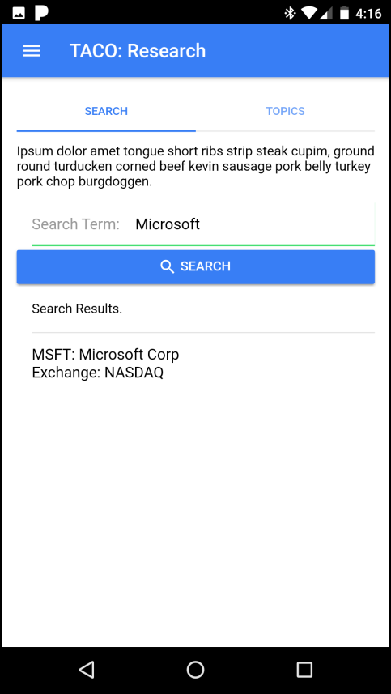

Tap the stock listing to view details about the stock as shown in the figure below. Tap the + symbol in the lower-right corner of the page if you're interested in this particular stock and wish to be notified when the stock price exceeds specific thresholds using the app's **Alert** capabilities (described in the next section). 

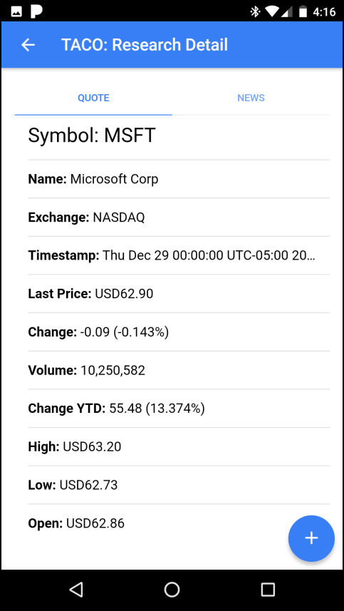

The **NEWS** tab on the page displays a list of Bing news stories for the selected stock.

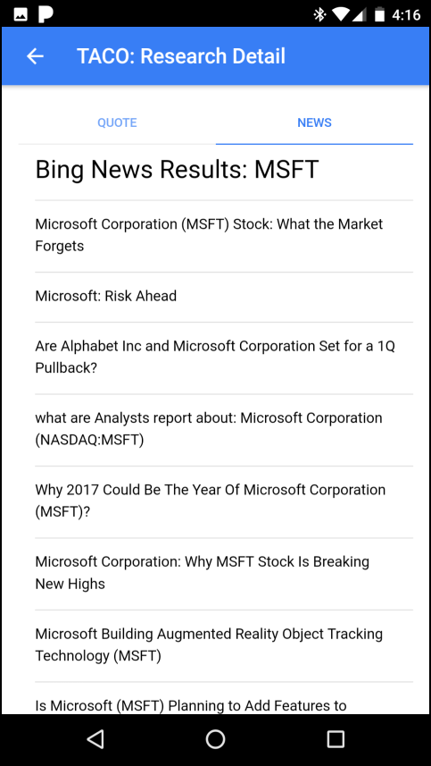

### Alerts

The **Alerts** area of the application lets users manage stock alerts defined within the application. With this feature, users identify which stocks they're interested in monitoring and the price or performance thresholds that trigger a **push** notification to the application. 

> **Note**: Alerts are only available when online mode is configured. 

Use the application menu to access the Alerts area of the app; tap the menu button in the upper-left corner of the application window to open the menu. The **Alert List** page displays a list of alerts defined in the application for the current user. From this page, you can:

+ **View Alert details** - Tap on an item in the list to view detailed information about the selected Alert.
+ **Edit Alerts** - Swipe an Alert to the left to open the menu, and then tap **Edit** to edit the selected Alert. 
+ **Delete Alerts** - Swipe an Alert to the left to open the menu, and then tap **Delete** to delete the selected Alert.

> **Note**: You cannot add an Alert from the Alert List; Alerts can only be added from the Research area of the app. Eventually, you'll be able to add an alert from the Investment details page.

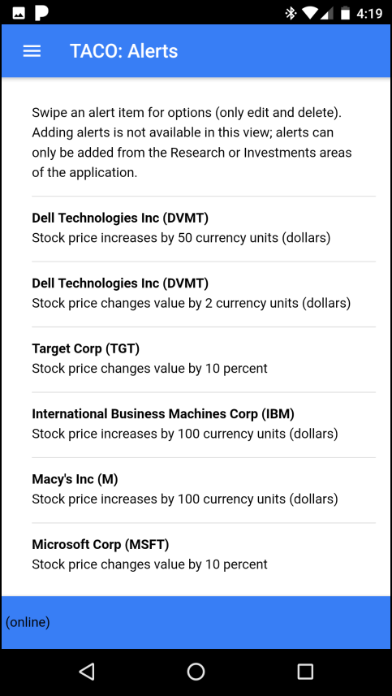

When you view an Alert, the application displays a summary of the Alert's trigger as shown below.

When creating or editing an Alert, users must select the **Trigger** for when the alert is sent:

+ Above Threshold - Trigger the alert when the stock price exceeds a specific threshold (either a specific price or % change). 
+ Below threshold - Trigger the alert when the stock price drops below a specific threshold (either a specific price or % change).
+ Changes Value - Trigger the alert when the stock price changes value by a specific threshold (either a specific price or % change).

The **Threshold** field requires a numeric value and is used with the **Unit** field to define the trigger threshold. For example: $10 dollars or 15% change. Valid options for Unit are:

+ **Currency Unit** (US Dollars for example)
+ **Percentage**

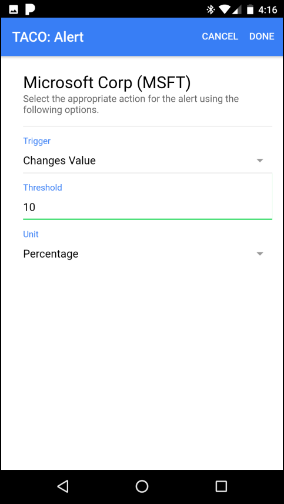

With the alert in place, the project's Azure Functions functions will process the alert list periodically and send notifications through Azure Notifications Hub to the mobile device.

## Configuring The Application

The application's static configuration is controlled through variables defined in the project's **Config provider** through the `FinanceAppIonic\src\providers\config.ts` file. Open the file in Visual Studio and set the following values as appropriate for your implementation of the application.

### Application Title Strings

Rather than hard-code the application title on all of the application's pages, the project's provider exposes two constants that are used, as needed, in each page's headers:

	//String values used in the app page titles and menus
	//The long version of the name appears in the header
	//of the start page
	appNameLong = 'TACO Investment Services';

	//The short version appears in the menu and all the other
	//form and page headers
	appNameShort = 'TACO';

The `appNameLong` value is displayed in the Start page header (and nowhere else). The `appNameShort` value is displayed in the header on all other pages as well as in the title bar for any dialogs displayed by the application. 

### Azure Services Options

The application uses the `authEndpoint` value to tell the `Microsoft.WindowsAzure.MobileServiceClient` how to find the cloud application that hosts the data and authentication for the application. Populate the variable with the appropriate application endpoint; it should be an HTTPS URL ending in `azurewebsites.net` as shown below:

	//change this endpoint for your Azure project	
	authEndpoint = 'https://my_app_name.azurewebsites.net';

The application project defaults to using Azure Active Directory to validate user credentials as part of the login process. If you decided to change the auth provider to something else, you will need to change the value for the `authProvider` variable. 

	//The MobileServiceClient supports multiple auth providers,
	//for this app, we'll just use AAD.
	authProvider = 'aad';    //Azure Active Directory

Supported options for `authProvider` are:

+ `aad`
+ `facebook`
+ `google`
+ `microsoftaccount`
+ `twitter`

### Bing Search API Settings

To enable the news search capabilities of the Research area of the application, you'll need to register for a [Microsoft Cognitive Services](https://www.microsoft.com/cognitive-services/en-us/apis) account and obtain a key for the [Bing News Search API](https://www.microsoft.com/cognitive-services/en-us/bing-news-search-api). Populate the `bingSearchKey` with the API key.
	
	//API key used to access the Bing News search API
	//https://www.microsoft.com/cognitive-services/en-us/subscriptions	
	bingSearchKey = '';  

### Secure Storage Settings

The Ionic Secure Storage component allows you to provide a name for the storage location used by the application. You can change this name by modifying the `secureStoreName` variable shown below:

	//Used when creating secure storage
	secureStoreName = 'TACO-Investment-Tracker';