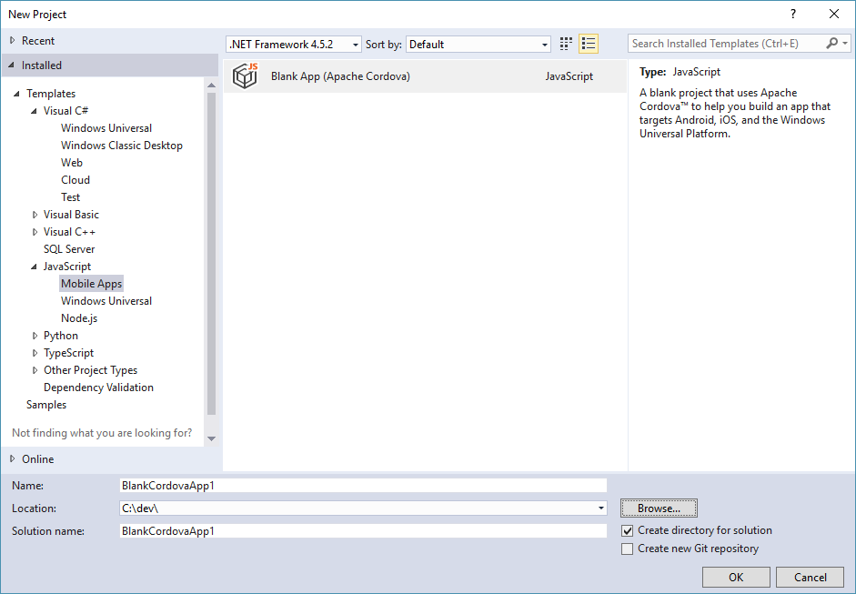
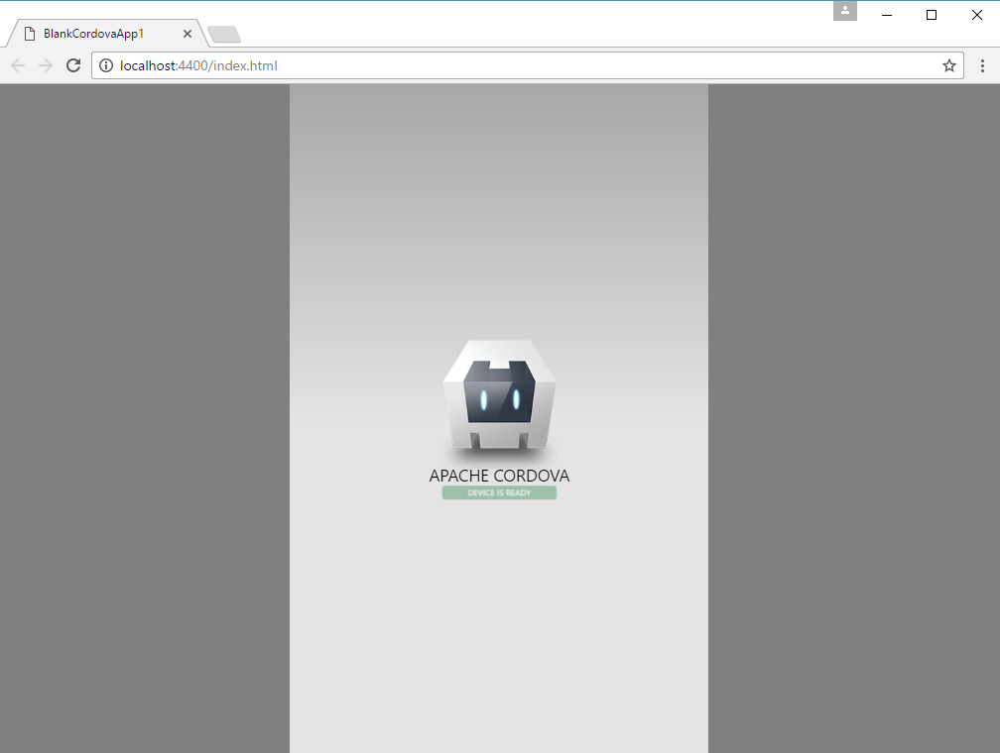
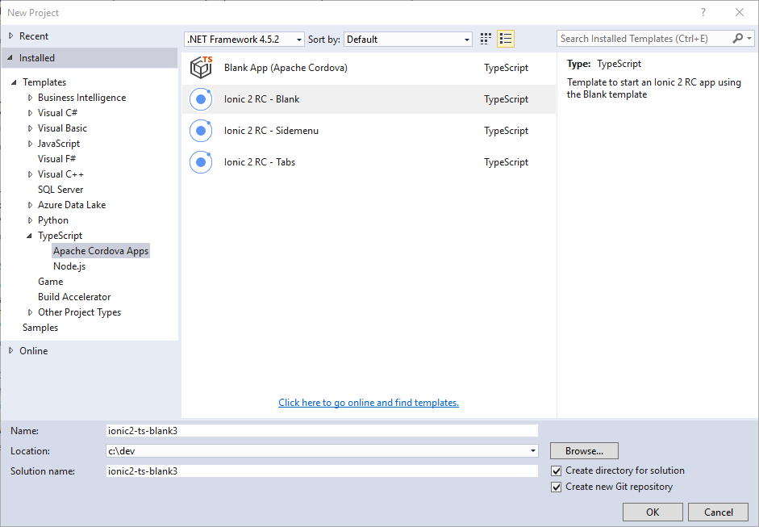
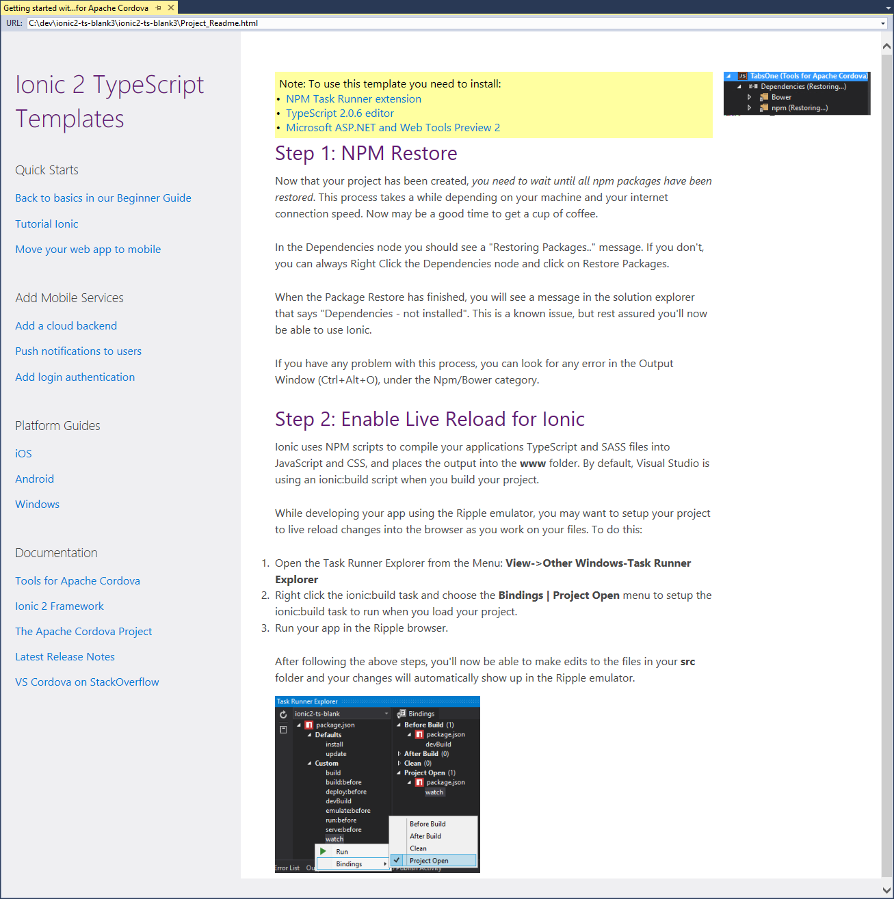
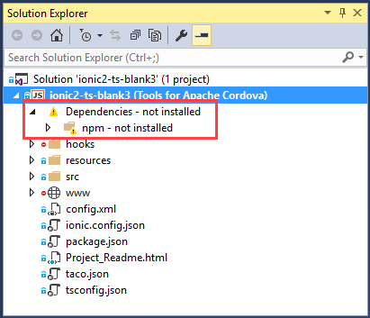

# Get started with Ionic 2 and Visual Studio
 
## Introduction

Ionic is a popular front-end JavaScript framework for building cross-platform mobile apps using [Apache Cordova](http://cordova.io). Cordova provides developers with the ability to build native mobile apps using HTML, JavaScript, and CSS, plus access to native APIs from the web application’s JavaScript code. Ionic gives Cordova applications a platform-aware user interface and manages most interaction with the application user.

You can develop and build Cordova and Ionic applications using your web application editor of choice and the command-line interfaces (CLI) provided by both Cordova and Ionic, but Microsoft Studio coupled with Visual Studio Tools for Apache Cordova (TACO) provides developers with a streamlined way to create, code, test and debug applications for Android, iOS and Windows, all from a single IDE.

In this lesson, you’ll learn how to create a simple Ionic 2 application using Visual Studio, then test and debug the application using the tools provided by TACO. In subsequent lessons, you’ll work with a more sophisticated application, one that leverages some of the capabilities of the Microsoft Azure Cloud as well. For now, though, you’re going to learn your way around an Ionic 2 app in Visual Studio.

## Requirements

To manage Ionic 2 application projects using Visual Studio, you will need to install the following:

+	Visual Studio 2017 – [Download the IDE](http://go.microsoft.com/fwlink/?LinkID=533794). 
+	Visual Studio Tools for Apache Cordova (TACO) – Install TACO using the Visual Studio Installer; [learn more](https://taco.visualstudio.com/en-us/docs/vs-taco-2017-install).
+	Visual Studio Ionic 2 Templates (described below).
+	Ionic Template dependencies (described below).
+	[Google Chrome browser](https://www.google.com/chrome) (used by Visual Studio’s Simulate in Browser option).
 
## Validating the TACO Installation

Under the covers, Ionic apps are Apache Cordova apps, so you'll need a functional Cordova development environment before you can use with Ionic. When you install Visual Studio, make sure you include the optional components, HTML/JavaScript (Apache Cordova) under Cross-Platform Mobile Development. Before we install the Ionic 2 templates, verify the TACO installation by creating and running an application using the default Cordova Blank App template.

1.	In Visual Studio 2017, open the **File** menu, select **New**, then **Project**.
	
2.	In the **New Project** dialog, expand the **JavaScript** templates section, expand **Mobile Apps**, then select the **Blank App (Apache Cordova)** template. If you don’t see this as an option, double check to ensure you successfully installed TACO.

	 
 
3.	Give the new project a **Name** and **Location**, or leave the default values, and then click the **OK** button to create the application project.

4.	At this point, you’ll have a new, empty Apache Cordova project. Visual Studio will open the solution’s readme file as shown below:

	 
 
5.	Press **F5** to build and run the new Cordova application using the **Simulate in Browser** option. Simulate in Browser replaced the Ripple Emulator found in earlier versions of TACO. At this point, Visual Studio will install some software, then build and run the application in Chrome as shown in the following figure.

	 
 
If you have any issues running the application, see these troubleshooting steps.

## Installing the Ionic 2 templates

You can install the Ionic 2 templates for Visual Studio directly from within Visual Studio:

1.	Open Visual Studio 2017, then open the **Tools** menu, and select **Extensions and Updates....**

2.	In the Extensions and Updates dialog, select **Online**.

3.	In the search box located in the upper-right corner of the dialog, type **Ionic 2**.

	**UPDATE THE FOLLOWING FIGURE ONCE THE TEMPLATES ARE AVAILABLE FOR VS2017**

	 
 
4.	Select **Ionic 2 RC Templates** in the list, make sure the template publisher is **Microsoft**. Click the **Download** button to start the installation process.

5.	The template installer will download, then Visual Studio will automatically start the installation process. When prompted, click the Install button to begin the installation.

	> **Note**: The Ionic templates will not appear in Visual Studio until it's restarted, so close, then re-open Visual Studio 2017 before continuing.

To use the Ionic templates, you'll also need to install the following Visual Studio extensions:

+	NPM Task Runner
+	TypeScript 2.0.6 editor
+	Microsoft ASP.NET and Web Tools Preview 2

Each of the extensions are installable from within the **Extensions and Updates** area of Visual Studio.

## Creating an Ionic Project in Visual Studio

With the Ionic 2 templates installed in Visual Studio 2017, it’s time to create your first Ionic 2 project. Open Visual Studio 2017, then:

1.	Open the **File** menu, select **New**, then **Project**.

2.	In the **New Project** dialog, expand the **TypeScript** templates section, select **Apache Cordova Apps**, then pick one of the available **Ionic** templates for the project

	**UPDATE THE FOLLOWING FIGURE ONCE THE TEMPLATES ARE AVAILABLE FOR VS2017**

	 
 
3.	Give the new project a Name and Location then, click the OK button.

Visual Studio will whir and click for a while as it creates the new project for you. When the process completes, check the new solution’s readme file (shown below) for any additional tools that must be installed to use the templates. At a minimum, you’ll need the **extra extensions** already listed in the installation section, so be sure they’re installed before continuing.

 
 
Ionic is a heavy framework, it uses a lot of tools and libraries. Once Visual Studio creates the new project, it kicks off a process to download and install the required components using the **Node Package Manager** (npm). You’ll have to wait a few minutes, and it will be at least a few minutes, as Ionic's npm packages are installed. To check progress, open Solution Explorer and look for the Dependencies node. You should see **Restoring...**, if you don't see this within a minute or so, right-click on the **Dependencies** node and click **Restore Packages**.

You can monitor the installation process through Visual Studio's **Output window**. Open the **View** menu, then select **Output** or use the keyboard shortcut **Ctrl**-**W** + **O**. Over time, you’ll see a lot of content written to the window. At the end of the process, a complete list of all the node modules installed into the project will display in the window. Once that list appears, you’ll know it’s complete.

 
 
> **Note**: After Visual Studio finishes installing dependencies, the **Dependencies** node may show **not installed**. This is a known issue; the Ionic project will be OK at this point.

 
 
At this point, you have a complete Ionic application project ready to go. To see the app running, select a **target platform** in the **Standard Toolbar**, select a **target device**, then press **F5** to run the application on the selected target. You’ll learn more about the different execution options later in this lesson.

> **Note**: Running (and debugging) iOS applications requires some extra configuration; refer to the Visual Studio Tools for Apache Cordova: [iOS Guide](../getting-started-2017/vs-taco-2017-ios-guide/md) for additional information.

## Ionic 2 Project Tour

The solution Visual Studio created is an Ionic 2 project, but since Ionic uses Apache Cordova under the covers, it’s also an Apache Cordova project. As you look at the Solution Explorer window shown below, you’ll see elements of both, along with some housekeeping files created and maintained by Visual Studio.

 
 
The project’s **config.xml** file is the standard Cordova project configuration file. Visual Studio provides a special editor for this file, eliminating the need to edit the file’s XML directly. Instead, the editor provides a Windows dialog that exposes the file’s different settings as edit fields, drop-downs, and so on.

The most important files for you, are the files in the solution’s `src` folder. Normally, for an Apache Cordova project, you’ll code in the project’s `www` folder, then the Cordova build process copies your code into separate project folders for each target platform (using the Cordova project’s `platforms` folders, not shown in the figure).

Ionic projects are TypeScript projects, so all development work is performed in the `src` folder, and, during the build process, Visual Studio (through the Ionic CLI) compiles the contents of the `src` folder and copies the results into the `www` folder. Next, the Cordova tools (the Cordova CLI) copies the contents of the `www` folder into each target platform folder and kicks off a native build process for each.

Take a minute and familiarize yourself with the contents of the `src` folder.

The project’s `index.html` file is just like most any other basic `index.html` files. It has an `HTML` section, and a `BODY` section, plus it loads the project’s `CSS` and `.js` files. The only Ionic-specific code is the following:

```HTML
<!-- Ionic's root component and where the app will load -->
<ion-app></ion-app>
```

This is a placeholder for the content displayed by the Ionic application. The template code included in project pages (described later) files is processed at runtime and displayed within the `ion-app` element.

In the `src` folder, the `app` folder contains application-centric code and content:

+	`app.component.ts` – This is the application level component’s code, you’ll place code here that executes at application startup and handles application-level activities.
+	`app.html` – This is the html template for the application’s main page; You’ll add code here that you want included in every application page
+	`app.module.ts` – Used to define all of the components loaded by the application.
+	`main.ts` – The application’s execution starting point; this file loads everything else and kicks off the app.

Ionic uses **Components** to separate the different parts of an application’s UI and execution logic. The **pages** folder contains a sub-folder for each page of the application. The sub-folder stores the page’s **HTML template**, its corresponding **TypeScript** file and its **Sassy CSS** file.

The `src` folder will usually also contain a `providers` folder that stores TypeScript files for each data provider used by the application. The default sample project doesn’t include any providers, but you’ll find them in most Ionic applications.

## Running The Application

Visual Studio offers several ways for you to run this application. The following sections describe each option.

### Running the Application In The Browser

To make it easier for developers to quickly test a Cordova application's web content without launching a mobile device emulator or simulator, or connecting to a physical device, Visual Studio Tools for Apache Cordova includes a new browser-based simulator. Beginning with Visual Studio 2017, Microsoft replaced the open source Ripple emulator with the open source **Cordova Simulate**. Cordova Simulate enables developers to test a Cordova web application in the browser, and control plugin properties in Visual Studio while the application runs.

Cordova Simulate doesn't replace testing your app on physical devices, it merely simplifies iterative testing of your app's UI and JavaScript-based logic.

> **Note**: Cordova Simulate requires the **Google Chrome browser** to render the Cordova web app; make sure you have a recent build of the browser installed before launching Cordova Simulate. It also requires **Internet Explorer 11**; Cordova Simulate uses it to render its UI within Visual Studio. This means you'll have to be running Windows 8.1 and above, or Windows 7 SP1 (Internet Explorer 11 is not available on Windows 8).

1.	To launch Cordova Simulate, in the Visual Studio Standard toolbar, select a target OS from the list of available options; only Android and iOS are supported today. Next, in the Target list, select one of the available **Simulate in...** options.

	 

2.	Click the **selected target button**, or press the **F5** key and Visual Studio will prepare the app for deployment, and launch the Chrome Browser. Chrome renders the Cordova app's web application content while Visual Studio opens several debug panes (DOM Explorer and Plugin Controls) to help you test and validate your code. Use the Device Plugin Control to change the target device on the fly. Cordova Simulate changes the device profile then reloads the Cordova app in the browser. This enables you to quickly iterate through multiple target device models as you work.

As you tweak your app's code, live reload automatically updates the web application files in Cordova Simulate behind the scenes. Changes to the app's HTML and JavaScript code triggers a reload of the app in the browser. Changes to the app's non-executable code (images, CSS files and so on) are made available to the app running in Cordova Simulate immediately after the change is detected, but the web application isn't reloaded in the browser.


For apps running in Cordova Simulate, Visual Studio's **Plugin Controls** window enables developers to tweak the status and operation of most of the Cordova core plugins, enabling developers to quickly test all facets of the app's code that calls plugin APIs. Developers of custom or third-party plugins can easily enhance their plugins to support this feature. For non-supported plugins, Visual Studio exposes an interface developers use to provide responses to API calls for unknown plugins; developers can either provide responses for every call, or persist responses so they're sent for subsequent calls to the same API.

 

### Running the Application on an Android Device

Connect your **Android device** to the system running Visual Studio using a **USB cable**, then select **Device** from the list of available targets. When you click the Device button, Visual will build the application and deploy it to the connected device. As the app deploys, Visual Studio opens the **DOM Explorer** and JavaScript debugger to enable you to inspect the application content plus control and monitor execution of the application’s code.

### Running the Application on an iOS Device

Running a native mobile application on an iOS device requires access to a computer system running macOS. When working in Visual Studio on a Windows system, you’ll need to configure a nearby (or remote) Macintosh computer with some additional software to enable Visual Studio to communicate with the system, kick off a build of the application (using the native Xcode command-line tools and the Xcode compiler), and launch the application on an iOS device or simulator.

 
 
For complete instructions on how to setup a Macintosh system and test your Ionic applications on iOS, refer to [iOS Guide](../getting-started-2017/vs-taco-2017-ios-guide/md).

## Debugging Applications

The full debugging capabilities of Visual Studio are available when running Cordova and Ionic applications. As shown previously, the web application DOM Explorer opens automatically when you launch a debug session in Visual Studio. Using DOM Explorer and the Visual Studio JavaScript debugger, you can view and adjust the HTML content on the fly, and set breakpoints and watches in your JavaScript code to help with debug sessions.
