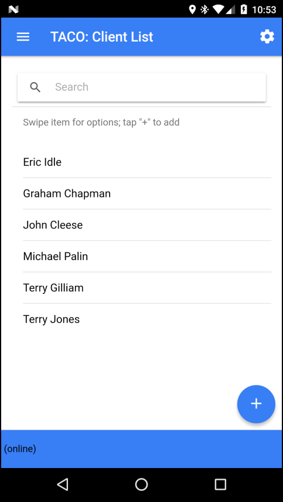
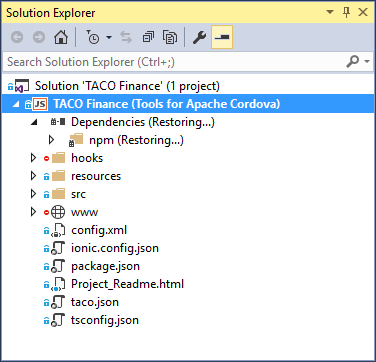
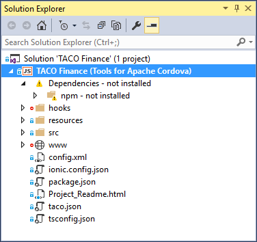
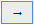
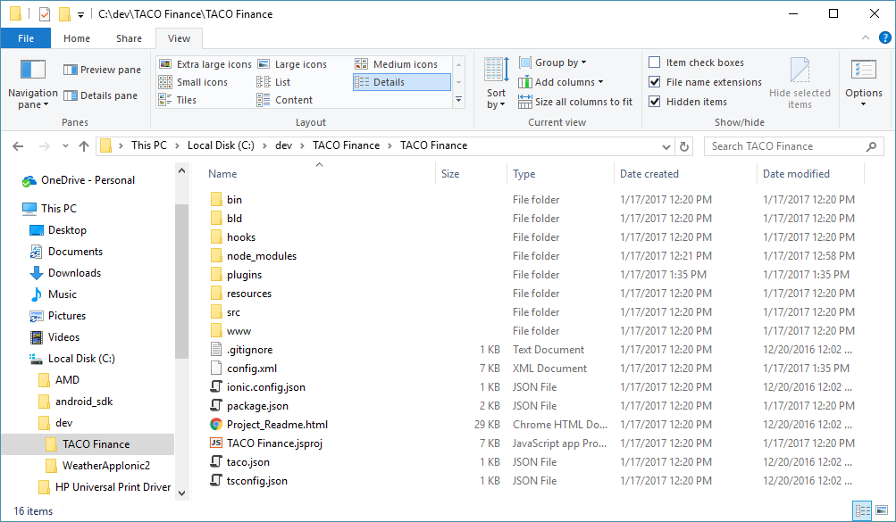
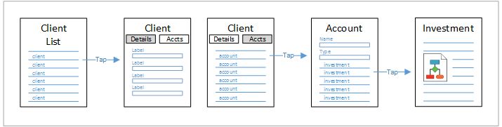
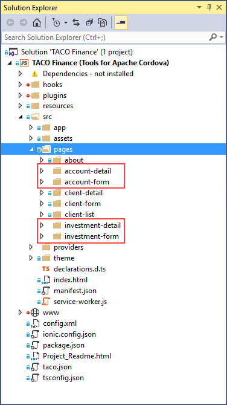

# Creating the TACO Finance App
 
## Introduction

In this tutorial, you’ll start building the TACO Finance application using Visual Studio. In subsequent tutorials in this series, you’ll add more sophisticated capabilities to the application. The TACO Finance App consists of a client application and a suite of back-end services that enable capabilities in the mobile application. For trial and demonstration purposes, the application can operate without the back-end services, but application capabilities will be limited.

### Client Application

The application addresses many of the requirements for a financial advisor, enabling investment managers to manage the following client-related content while away from the office:

+	**Clients**: View a list of Clients plus add, edit and delete Client records.
+	**Accounts**: For each client, view a list of Accounts plus add, edit and delete client Account records. 
+	**Investments**: For each Account, view a list of Investments plus add, edit and delete Investment records.
+	**Research**: Lookup company stock information such as current price, high, and low values. Graph performance data over time and add alerts for selected stocks.
+	**Alerts**: Enables application users to configure the application to notify them when specific stock values increase or decrease beyond thresholds.

The complete page flow (Ionic uses pages rather than screens for views) for the application is shown in the following figure. The highlighted area of the figure shows the parts of the application you’ll be building in this tutorial. Lets talk about what each page does and what it’s used for; the following table list each page component used for client management.
 


<table border="1">
<tr>
<th>Page</th>
<th>Description</th>
</tr>
<tr>
<td>account-detail</td>
<td>Displays information about the selected Account as well as a listing of investments associated with this Account. Users:
<ul>
<li>Tap an Investment item in the list to display a page listing detailed information about the selected Investment.</li>
<li>Swipe on an investment in the list to edit or delete the selected Investment record.</li>
<li>Tap the plus symbol on the page to add a new Investment to the Account.</li>
</ul> 
Code in the component references the investment-detail and investment-form pages.</td>
</tr>
<tr>
<td>account-form</td>
<td>Used to create new Account records.</td>
</tr>
<tr>
<td>client-detail</td>
<td>Displays detailed information about the selected client. Uses an Ionic Segment control to display data in two tabs on the page. The first tab lists client information, the second tab displays a list of accounts associated with the selected client. Users:
<li>Tap an account item in the list to display a page listing information about the selected account.</li>
<li>Swipe on an account to edit or delete the selected account.</li>
<li>Tap the plus symbol on the segment to add a new account for the client.</li>
Code in the component references the account-detail and account-form pages.</td>
</tr>
<tr>
<td>client-form</td>
<td>Used to create new Client records.</td>
</tr>
<tr>
<td>client-list	</td>
<td>Displays a list of client records. Users:
<li>Tap a client item in the list to display a page listing information about the selected Client.</li>
<li>Swipe on a Client in the list to edit or delete the selected Client record.</li>
<li>Tap the plus symbol on the page to add a new Client to the application.</li>
Code in the component references the client-detail and client-form pages.
</td>
</tr>
<tr>
<td>investment-detail</td>
<td>Displays detailed information for the selected Investment; information about the client’s investment in the stock as well as stock performance information and graphs.</td>
</tr>
<tr>
<td>investment-form</td>
<td>Used to create new Investment records.</td>
</tr>
</table>

### Back-end Application
 
On the back-end, the application makes use of several Microsoft cloud services to deliver capabilities for the client application:

+	[Azure Active Directory}(https://www.microsoft.com/en-us/cloud-platform/azure-active-directory) – Provides a cloud-based implementation of Microsoft Active Directory that application uses to authenticate users. 
+	[Azure Functions](https://azure.microsoft.com/en-us/services/functions/) – Manages the alerting capabilities of the app. 
+	[Azure Mobile App Service](https://azure.microsoft.com/en-us/services/app-service/mobile/) – Provides authentication services for the mobile application, data storage (using Azure Easy tables) and data synchronization (using offline data sync). 
+	[Azure Notification Hub](https://azure.microsoft.com/en-us/services/notification-hubs/) – Manages delivery of alert notifications to the mobile app.
+	[Microsoft Code Push](https://microsoft.github.io/code-push/) – Delivers application code updates over the air (OTA) from an administrator's command-line interface.

The interactions between the cloud services are highlighted in the following figure:

 

### Azure Mobile App Service

A mobile app defined in the **Azure Mobile App Service** provides the client application with a single access point for all of its data (online and offline), authentication, and other mobile capabilities. One of the key features of the service is **Easy tables**, mobile-friendly OData CRUD APIs backed by SQL Azure. Using Easy tables, the application exposes the following tables for use by the mobile client application:

+	Accounts
+	Alerts
+	Clients
+	Investments

Authentication for the mobile app is provided through Azure Active Directory, but exposed through the Azure Mobile App Service as part of its client API. The client application uses the [Azure Mobile Apps](https://github.com/Azure/azure-mobile-apps-cordova-client) Cordova plugin to:

+	Login to the server
+	Access the Easy Tables (create, read, update, delete records)
+	Enable offline access

### Stock Alerts

The client application's Alerts capability enables users to manage stock alerts defined within the application. With this feature, users identify which stocks they're interested in monitoring and the price or performance thresholds that trigger a push notification to the application. Alerts data is stored in the Azure Mobile App Service Alerts Easy table. On the back-end, Alerts utilize [Azure Functions](https://azure.microsoft.com/en-us/services/functions/) and the [Azure Notification Hub](https://azure.microsoft.com/en-us/services/notification-hubs/) to manage processing and delivery of alerts to the user's mobile device.

The app uses two Azure Functions: **Process Alerts** and **Send Notification**. The Process Alerts function reads the Alerts table and determines whether an alert threshold is met. For each alert, it looks up the stock's current price using a third-party stock service (described in the following section), and then checks stock prices against alert trigger thresholds. When a threshold has been exceeded, notifications are deposited in a queue for further processing.
The Send Notification function reads entries from the queue and submits a push notification request to the Azure Notification Hub for delivery through the target mobile platform's push notification service.  

### Stock Service

The application currently uses a third-party stock lookup service from [Markit On Demand](http://dev.markitondemand.com/MODApis/) to provide stock and stock performance data for the application. The app uses the service to:

+	**Search for specific companies** - Used for research and alerting purposes.
+	**Retrieve immediate stock performance (price) data** - Used for research and alerting purposes.
+	**Retrieve long term stock performance data** - Used for graphing stock performance.

The service is used by the client application as well as the Azure Functions Process Alerts function.
 
## What You’ll Build In This Tutorial

What you’ve seen in the previous sections is a description of the complete TACO Finance App project. There’s a lot of moving parts there, so it’s better to break implementation into multiple, easy to digest, segments. So, for this tutorial, you’ll create a new Ionic 2 application project, then implement only the core client management capabilities of the app.

You’ll start by adding three providers to the project. **Providers** add an abstraction layer for access to the application’s data. You’ll add a **Config provider** which serves the application’s configuration settings. You’ll also create a **Client Data provider** to the project, this provider uses Ionic’s **Storage** capabilities to provide access to the app’s client data. From the Ionic documentation: 

> “Storage is an easy way to store key/value pairs and JSON objects. Storage uses a variety of storage engines underneath, picking the best one available depending on the platform.

> When running in a native app context, Storage will prioritize using SQLite, as it's one of the most stable and widely used file-based databases, and avoids some of the pitfalls of things like localstorage and IndexedDB, such as the OS deciding to clear out such data in low disk-space situations.

> When running in the web or as a Progressive Web App, Storage will attempt to use IndexedDB, WebSQL, and localstorage, in that order.”

In later tutorials, you’ll add other data access providers, then add a settings page you can use to switch between them.
 
Next, you’ll implement the **Client List** page shown in the following figure. With that in place, you’ll wire it into the data provider, add the **Client form** and **Client Details** page. You’ll add the **Account List** to the Client Details page and, finally, add the Investments management capabilities through the **Investment Form** and **Investments Details** page.

 

 

 

  

## Requirements

To build the TACO Finance App using Visual Studio, you must install the following:

+	Visual Studio 2017 – Download the IDE at [http://go.microsoft.com/fwlink/?LinkID=533794](http://go.microsoft.com/fwlink/?LinkID=533794). 
+	Visual Studio Tools for Apache Cordova (TACO) – Install TACO using the Visual Studio Installer; [learn more](https://taco.visualstudio.com/en-us/docs/vs-taco-2017-install).
+	Visual Studio Ionic 2 Templates - Described in the [Ionic Tutorial](). 
+	Ionic Template dependencies - escribed in the [Ionic Tutorial]().
+	Google Chrome browser (used by Visual Studio’s Simulate in Browser option).

## Building the Finance Application

### Clone the Github Repository

Some of the code listings for this application are quite long, so rather than make you copy large blocks of code from this document, you’ll start by cloning the project’s Github repository to your local system to streamline this exercise. Open a terminal window and navigate to the folder where you want to store the code and execute the following command:

```
git clone https://github.com/Microsoft/cordova-app-recipe-finance
```

### Create and Configure the Ionic Project

You’ll start by creating and configuring an Ionic project in Visual Studio. Open Visual Studio and execute the following steps:

1.	Create a new ionic project in Visual Studio 2017. Open the **File** menu, select **New**, then **Project**.

2.	In the dialog that appears, expand the **Templates** section, then **TypeScript** and select the **Apache Cordova Apps** option. Select the **Ionic 2 RC Blank** template as shown in the following figure. Give the project a **Name**, and specify a **Location** for the project, then click the **OK** button.

	 
 
3.	Visual Studio will create the project, then open the project’s **Solution Explorer**. Ionic projects require installation of several tools and libraries, so you’ll notice activity as the **Dependencies** folder populates with the necessary files as shown in the following figure. Give Visual Studio a few minutes to install the project dependencies.

	 

	> **Note**: There’s a known issue where Solution Explorer shows that the dependencies didn’t install correctly as shown in the following figure. This is a known issue, and should be resolved by the time you read this. Until then, you can ignore this error.

	 
  
4.	Under the covers, an Ionic project is an Apache Cordova project. So, to change settings for the native application container, open the project’s Cordova configuration file by double-clicking on the project’s `config.xml` file in Solution Explorer. Visual Studio will open a custom editor for the file as shown in the following figure:

	 

5.	Set the appropriate project settings in the editor’s **Common** panel. At a minimum, you should give the project a recognizable **Display Name** and a unique **Package Name**. Populate the project’s **Author** field with your name (or an alias if you’re so inclined) and a **Description**.
Press **Ctrl**-**S** to save your changes to the file.
 
6.	The Ionic Storage provider uses the **Cordova SQLite Storage plugin** ([cordova-sqlite-storage plugin](https://github.com/litehelpers/Cordova-sqlite-storage)) under the covers, so lets add it to the project. Switch to the **Plugins** pane shown on the left of the following figure. Select the Cordova Sqlite Storage plugin as shown in the figure, and click the **Add** button to add the plugin to the project.

	 
 
7.	The Ionic Secure Storage provider uses the **Cordova SecureStorage** plugin ([cordova-plugin-secure-storage](https://github.com/Crypho/cordova-plugin-secure-storage)), so lets go ahead and install it as well. The plugin isn’t available as one of the core plugins in TACO, so the steps to add it to your project are slightly different.

	In the Plugins area of the `config.xml` editor, select the **Custom** tab as shown in the following figure. Select the **Plugin ID** radio button and where the form asks you for the **ID of the plugin you want to install**, enter **cordova-plugin-secure-storage**. Click the   button to search for the plugin. When Visual Studio finds it, it will open up the panel to the right listing details about the plugin. Click the **Add** button to add the plugin to your project.

	 
 
### Add the Application Menu

The application’s menu displays on many, but not all pages in the application. To enable this, you’ll add the menu markup code to the project’s `src\app\app.html file`, then display the **menu toggle** icon on the pages where we want the menu active.

1.	In the Solution Explorer, double-click on the project’s `src\app\app.html` file, and replace its contents with the following:

	```HTML
	<!-- logged out menu -->
	<ion-menu id="loggedOutMenu" [content]="content">
	  <ion-header>
	    <ion-toolbar>
	      <ion-title>{{config.appNameShort}} Menu</ion-title>
	    </ion-toolbar>
	  </ion-header>
	  <ion-content class="outer-content">
	    <ion-list>
	      <button ion-item menuClose *ngFor="let p of appPages" (click)="openPage(p)">
	        <ion-icon item-left [name]="p.icon"></ion-icon>
	        {{p.title}}
	      </button>
	    </ion-list>
	  </ion-content>
	</ion-menu>
	
	<!-- logged in menu -->
	<ion-menu id="loggedInMenu" [content]="content">
	  <ion-header>
	    <ion-toolbar>
	      <ion-title>{{config.appNameShort}} Menu</ion-title>
	    </ion-toolbar>
	  </ion-header>
	  <ion-content class="outer-content">
	    <ion-list>
	      <button ion-item menuClose *ngFor="let p of appPages" (click)="openPage(p)">
	        <ion-icon item-left [name]="p.icon"></ion-icon>
	        {{p.title}}
	      </button>
	      <button ion-item menuClose *ngFor="let p of loggedInPages" (click)="openPage(p)">
	        <ion-icon item-left [name]="p.icon"></ion-icon>
	        {{p.title}}
	      </button>
	    </ion-list>
	  </ion-content>
	</ion-menu>
	
	<!-- main navigation -->
	<ion-nav [root]="rootPage" #content swipeBackEnabled="false"></ion-nav>
	```

	This markup creates two menus: one that renders menu items for **logged in users**, and another that renders menu items for **logged out users**. Code in the project’s `src\app\app.component.ts` file populates these menus at startup, then swaps in the appropriate one in depending on the user’s status.

	The modified `ion-nav` element adds the `swipeBackEnabled` attribute which controls whether the user can swipe to go back between pages. Since the application protects access to data through a login (something we’ll add in a separate tutorial) process, we don’t want the users being able to do that, so the attribute is set to `false`.

2.	Open the project’s src\app\app.component.ts file. The code in this file executes at app launch and initializes the application. At the start of the file are two import statements:

	```TypeScript
	import { Component } from '@angular/core';
	import { Platform } from 'ionic-angular';
	```

	Replace the statements with the following:

	```TypeScript
	import { Component, ViewChild } from '@angular/core';
	import { Events, MenuController, Nav, Platform } from 'ionic-angular';
	```

	These statements load some additional components that will be used soon.

3.	Immediately below the import statements, add the following interface definition:

	```TypeScript
	export interface PageObj {
	    title: string;
	    component: any;
	    icon: string;
	    logsOut?: boolean;
	    index?: number;
	}
	```

	This defines an interface for the menu item object. You’ll see how they’re used in a minute.

4.	In the constructor for the `MyApp` class, add the following line as an input parameter in the constructor:

	```TypeScript
	public menu: MenuController,
	```
	
	When you’re done, the constructor should look like the following:

	```TypeScript
	constructor(
	  public menu: MenuController,
	  platform: Platform
	)
	```

5.	Inside the `MyApp` class, add the following code:

	```TypeScript
	// the root nav is a child of the root app component
	// @ViewChild(Nav) gets a reference to the app's root nav
	@ViewChild(Nav) nav: Nav;
	
	/* Create two arrays, one that lists the menu items that appear
	   always, and another that lists the menu items that appear only
	   when you're logged into the app. This isn't necessarily the 
	   best way to do this, but it simplifies page loading through the 
	   openPage function below. This code was borrowed from a conference
	   app example. */
	appPages: PageObj[] = [
	  { title: 'Clients', component: ClientList, icon: 'contacts' },
	  //{ title: 'Research', component: ResearchPage, icon: 'bookmarks' },
	  { title: 'About', component: AboutPage, icon: 'information-circle' }
	];
	
	loggedInPages: PageObj[] = [
	  //{ title: 'Alerts', component: AlertList, icon: 'alert' },
	  //{ title: 'Logout', component: StartPage, icon: 'log-out', logsOut: true }
	];
	
	rootPage: any = {};
	```

	`@ViewChild` gets a handle to the root navigational element for the application and assigns it to the `nav` variable. In the next step, you’ll add code that leverages this variable to force different pages to the top of the navigational stack. The application does this to have a tighter control over page navigation, specifically so that later, when we add support for logging in, the user can only traverse the navigational path the application lays out for them.

	The `appPages` and `loggedInPages` arrays maintain the list of `menu` objects used to display the app’s menu and enable navigation between pages. As you can see, several of the array objects are commented out, this is because we’ve not yet added the pages referenced in these objects, so you’ll get errors from Visual Studio without those lines commented out. You’re likely already getting errors for the `AboutPage` and `ClientList` objects – we’ll fix those errors in later steps.
	
	Finally, the `rootPage` assignment tells the component which page to load when the app launches. You’ll add the `ClientList` page a little later, so you can ignore, for now, the error Visual Studio displays on that line.
 
5.	Add the following code to the `constructor`, immediately following the code that hides the splash screen:

	```TypeScript	
	this.menu.enable(true, 'loggedOutMenu');
	this.menu.enable(false, 'loggedInMenu');
	
	this.rootPage = ClientList;
	```

	The first two lines enable the base menu for the application. Later, when we add login capabilities to the app, you’ll swap these lines out for something more interesting. The last line opens the `ClientList` page.

6.	Finally, add the following function to the body of the `MyApp` class. This code manages switching pages to the top of the navigation stack based on menu selections.

	```TypeScript
	openPage(page: PageObj) {
	  //Does the page log the user out?
	  if (page.logsOut === true) {
	    //First, close the menu to get it out of the way
	    this.menu.close();
	    //Switch to the specified page
	    this.nav.setRoot(page.component);
	  }
	}
	```

### Implement Providers

At this point, you have the rough beginnings of an Ionic application. We haven’t added anything to the Home page, so if you ran the application, not much would happen. Plus, the app has that lingering error about the `ClientList` object, that won’t be fixed until the next section.

Visual Studio and TACO deliver a robust development and debugging environment for Ionic 2 applications. However, there are a couple of Ionic application management tasks that require the use of the Ionic CLI. In this section, you will install the Ionic CLI, then use it to create a couple of providers.

1.	If you haven't done so already, install the latest **Node JavaScript runtime** from [nodejs.org](nodejs.org). You'll want the latest **LTS** version.

2.	Install the Apache Cordova and Ionic CLIs: open a terminal window and execute the following command:

	```
	npm install -g cordova ionic
	```

3.	Validate that the tools work by executing the `cordova` and, separately, `ionic` commands in the terminal window. You should see help content displayed in response to these commands. If you receive error messages, you'll have some additional work to do to fix any issues that exist with your configuration.

4.	Open a terminal window and navigate to the project's Ionic project folder. In the examples shown earlier, the folder is `c:\dev\TACO Finance\TACO Finance`. The nested folders in the path were created because the option to **Create directory for solution** was selected when creating the project. The project you want is the one that contains the `src` and `www` folders shown in the following figure:

	 

	> **Note**: The easiest way to open a terminal window in a folder is to open **Windows Explorer** and navigate to the folder as shown in the figure. Once there, click in the **folder path** field at the top of the window (the one that says: **This PC > Local Disk (C:) > dev** and so on) and type `cmd` and press **Enter**. Windows will launch a command prompt in the selected folder.

5.	When the terminal window is pointing to the right folder, execute the following command:

	```
	ionic g provider Config
	```

	This executes the Ionic `generate` command, used to **generate Ionic components** for your app. In this case, you’re creating a new `provider`; the Ionic CLI will create a folder called `src\providers` and add a file to the folder called `config.ts` as shown in the following figure:

	 
 
6.	Replace the contents of the generated `config.ts` file with the following code:

	```TypeScript
	import { Injectable } from '@angular/core';
	import { Storage } from '@ionic/storage';
	
	@Injectable()
	export class Config {
	
	  //String values used in the app page titles and menus
	  //The long version of the name appears in the header
	  //of the start page
	  appNameLong = 'TACO Investment Services';
	  //The short version appears in the menu and all the other
	  //form and page headers
	  appNameShort = 'TACO';
	
	  //change this endpoint for your Azure project
	  authEndpoint = '';
	
	  //The MobileServiceClient supports multiple auth providers,
	  //for this app, we'll just use AAD.
	  authProvider = 'aad';  //Azure Active Directory
	
	  //API key used to access the Bing News search API
	  //https://www.microsoft.com/cognitive-services/en-us/subscriptions
	  bingSearchKey = '';
	
	  //Used when creating secure storage
	  secureStoreName = 'TACO-Investment-Tracker';
	
	  //Storage types
	  public defaultStorageType = 'localstorage';
	  private storageTypeKey = 'storageType';
	
	  constructor(
	    private storage: Storage
	  ) {
	    console.log('Config: Constructor');
	    //Warn if our Azure App Service endpoint is not populated in the config file (config.ts)
	    if (!this.authEndpoint) {
	      //the user will see an alert if they try to login in online mode
	      console.error('You must populate the Azure App Services authEndpoint variable (config.ts) before using this application in online mode.');
	    }
	    //Warn if our Bing news search API keys are not populated in the config file (config.ts)
	    if (!this.bingSearchKey) {
	      console.error('You must populate the Bing search API key (config.ts) in order to access the Research News capabilities of this application.');
	    }
	  }
	
	  getStorageType(): Promise<string> {
	    console.log('Config: Entering getStorageType');
	    //Return a promise that we'll provide the storage type when available    
	    return new Promise(resolve => {
	      this.storage.get(this.storageTypeKey).then(res => {
	        //Did we read a value from storage?
	        if (res) {
	          console.log(`Config: Retrieved storage type: ${res}`);
	          //Yes? Then return it
	          resolve(res);
	        } else {
	          //No? Then use the default value
	          //First write the default value to storage
	          this.setStorageType(this.defaultStorageType).then(() => {
	            console.log(`Config: Using default storage type: ${this.defaultStorageType}`);
	            //then return the default value
	            resolve(this.defaultStorageType);
	          });
	        }
	      });
	    });
	  }
	
	  setStorageType(storageType: String): Promise<any> {
	    console.log('Config: Entering setStorageType');
	    //Return a promise that we'll set the storage type when we can
	    return new Promise(resolve => {
	      return this.storage.set(this.storageTypeKey, storageType).then(res => {
	        resolve(res);
	      });
	    });
	  }
	}
	```

	The point of this provider is to provide a single place to manage all application settings. The code contains some constants you should change for your implementation of the app as well as API keys the application. The provider also acts as an interface for managing app settings (added later) that can be set dynamically by the user, but will persist between sessions.

	The `appNameLong` and `appNameShort` variables define string values displayed within the app. The contents of the `appNameLong` variable are displayed in the toolbar on the application’s **Start** page (added when we add support for the Online use case in a later tutorial). The contents of `appNameShort` are displayed on the top of every other page and any alert dialogs presented to users. You can leave them as is, or change the values to match your needs.

	The `authEndpoint` constant defines the Azure Mobile App Service endpoint for the application. Populate this constant with the endpoint for your back-end implementation

	When you add Research capabilities to the application (in a later tutorial), you’ll populate `bingSearchKey` with the API key for your Bing account.

	The `getStorageType` and `setStorageType` functions are used by the Settings Page to store the user’s choice for data storage location.

7.	Now that you have the provider, you must let the application know about it. In **Solution Explorer**, double-click on the project’s `src\app\app.module.ts` file to open it. At the top of the file, add `imports` for the `Config` and `Storage` providers:

	```TypeScript
	import { Storage } from '@ionic/storage';
	import { Config } from '../providers/config';
	```

	The `Storage` provider you’re adding here adds support for the Cordova Sqlite plugin you added earlier.

	Next, add references to the `Config` and `Storage` components to the `providers` array as shown below:

	```TypeScript
	providers: [
	  Config,
	  Storage,
	  { provide: ErrorHandler, useClass: IonicErrorHandler }
	]
	```

	Press **Ctrl**-**S** to save your changes to the file.

8.	Open the project’s `src\app\app.component.ts` file, and add the following `import` to the top of the file:

	```TypeScript
	import { Config } from '../providers/config';
	```

	Next, add the following as a parameter to the constructor:

	```TypeScript
	public config: Config,
	```

9.	Add the `Client Data` provider to the project. Switch to the open terminal window pointing to the application’s Cordova/Ionic project folder, and execute the following command:

	```
	ionic g provider ClientData
	```

	This creates a new provider in `src\providers\client-data.ts` with a class name of `ClientData`.

10.	Now that you have the provider, you must let the application know about it. In Solution Explorer, double-click on the project’s `src\app\app.module.ts` file to open it. At the top of the file, add the following `import` for the new `ClientData` provider:

	```TypeScript
	import { ClientData } from '../providers/client-data';
	```

	Next, add a reference to the provider in the providers array as shown below:

	```TypeScript
	providers: [
	  ClientData,
	  Config,
	  Storage,
	  { provide: ErrorHandler, useClass: IonicErrorHandler }
	]
	```

	Save your changes to the file.

11.	Finally, add the following code to the project’s `src\providers\client-data.ts` file:

	```TypeScript
	import { Injectable } from '@angular/core';
	import { Platform } from 'ionic-angular';
	import { ClientDataStorage } from './client-data-storage';
	
	@Injectable()
	export class ClientData {
	
	  provider: any = ClientDataStorage;
	  public storageType: String;
	
	  constructor(
	    public localStore: ClientDataStorage,
	    public platform: Platform,
	  ) {
	    console.log('ClientData: Constructor');
	    //Make sure the platform is ready before you do anything
	    this.platform.ready().then(() => {
	      console.log('ClientData: Platform is ready');
	
	      //to use localstorage for the app, use the following:
	      this.provider = this.localStore;
	      this.provider.init(false);
	      this.storageType = ‘localstorage’;
	
	      //To use SecureStoreage for the app, use the following:
	      //this.provider = this.localStore;
	      //this.provider.init(true);
	      //this.storageType = ‘securestorage’;
	    });
	  }
	}
	```

	This code is essentially a shim that points `this.provider` to the `ClientDataStorage` provider and initializes it to use localstorage or SecureStorage depending on code in the constructor. Later, when you work on the Online and Offline versions of the application, you’ll replace this code with logic that uses the user’s settings within the application to drive the data provider selection. For now, this code is needed to reduce the number of changes you would have to make to other components to get the application working.

12.	Open the project’s `src\app\app.component.ts` file and add an `import` for the `ClientData` component:

	```TypeScript
	import { ClientData } from '../providers/client-data';
	```

	Next, add the following code as an additional parameter passed in the constructor:

	```TypeScript
	clientData: ClientData,
	```

	When you’re done, the constructor parameters should look like the following:

	```TypeScript
	constructor(
	  public config: Config,
	  clientData: ClientData,
	  public menu: MenuController,
	  platform: Platform
	) {
	```

	Finally, add the following line of code to the constructor as well:

	```TypeScript
	clientData.provider.init(false);
	```

	This initializes the `ClientDataStorage` provider and instructs it to use localstorage to store the application’s data. To use SecureStorage instead, change the line of code to:

	```TypeScript
	clientData.provider.init(true);
	```

13.	Add the Client Data Storage provider to the project. Switch to the open terminal window pointing to the application’s Cordova/Ionic project folder, and execute the following command:

	```
	ionic g provider ClientDataStorage
	```

	This creates a new provider in `src\providers\client-data-storage.ts` with a class name of `ClientDataStorage`.

14.	Now that you have the provider, you must let the application know about it. In Solution Explorer, double-click on the project’s `src\app\app.module.ts` file to open it. At the top of the file, add the following `import` for the new `ClientDataStorage` provider:

	```TypeScript
	import { ClientDataStorage } from '../providers/client-data-storage';
	```

	Next, add a reference to the provider in the `providers` array as shown below:

	```TypeScript
	providers: [
	  ClientData,
	  ClientDataStorage,
	  Config,
	  Storage,
	  { provide: ErrorHandler, useClass: IonicErrorHandler }
	]
	```

	Press **Ctrl**-**S** to save your changes to the file.
 
15.	Finally, add code to the project’s `src\providers\client-data-storage.ts` file. The code is quite large, so rather than list all the code here, grab the code from the same file in the project source you cloned from its Github repository at the beginning of this exercise.

	The provider delivers a full implementation for the data source used by the application. Specifically, it delivers capabilities the application uses to manage data for:

	+	Clients
	+	Accounts
	+	Investments
	
	For each of those data types, it provides functions for the following:
	
	+	Add
	+	Delete
	+	Edit
	+	Get
	
	In the provider is coded to use either localstorage or SecureStorage to store its data. Eventually, you’ll add a Settings page users can use to switch between storage modes. For now, the provider exposes an `init` method that accepts a Boolean parameter that controls which storage option is selected.
 
### Add an About Page

As an introduction to generating pages using the Ionic CLI, lets add an about page to the application. The app already has a menu item that refers to the page, so all you must do is generate the page, populate it with content and you’re all set.

1.	Switch to the open terminal window. If you closed it, open a new terminal window pointing to the project's Cordova/Ionic project folder. In the examples shown earlier, the folder is `c:\dev\TACO Finance\TACO Finance`. The nested folders were created because the option to **Create directory for solution** was selected when creating the project. The project you want is the one that contains the `src` and `www` folders.

2.	In the terminal window, execute the following command:

	```
	ionic g page About
	```

	This creates a new `about` folder in `src\pages` and populates the folder with the following files: `about.html`, `about.scss`, and `about.ts` as shown in the following figure. The `about.html` file contains the page’s HTML markup, the `about.scss` holds the page’s SASS content, and the `about.ts` contains the page’s TypeScript code.

	 

3.	Now that you have the page, you must let the application know about it. Open the project’s `src\app\app.module.ts` file. At the top of the file, add the following `import` statement:

	```TypeScript
	import { AboutPage } from '../pages/about/about';
	```

	Next, add references to the `AboutPage` component in the `@NgModule` declarations and `entryComponents` arrays:

	```
	AboutPage,
	```

	When you’re done, the arrays will look like the following:

	```TypeScript
	declarations: [
	  AboutPage,
	  HomePage,
	  MyApp
	],
	
	entryComponents: [
	  AboutPage,
	  HomePage,
	  MyApp
	],
	```

4.	Open the project’s `src\app\app.component.ts` file and add the following `import` statement:

	```TypeScript
	import { AboutPage } from '../pages/about/about';
	```

	Next, uncomment the following line in the class, it adds the About page to the application menu:

	```TypeScript
	{ title: 'About', component: AboutPage, icon: 'information-circle' }
	```

5.	Open the page’s `src\pages\about\about.html` file. As you can see, there’s not much there, just the scaffolding for an Ionic page. Replace the file’s contents with the following:

	```HTML
	<ion-header>
	  <ion-navbar>
	    <button ion-button menuToggle>
	      <ion-icon name="menu"></ion-icon>
	    </button>
	    <ion-title>{{config.appNameShort}}: About</ion-title>
	  </ion-navbar>
	</ion-header>
	
	<ion-content padding>
	
	</ion-content>
	```

	This code starts by adding the menu toggle button (with icon) to the page header. It also sets the navbar title for the page using the `appNameShort` variable defined in `src\providers\config.ts`.

	The `ion-content` tag defines the content area of the page. There’s nothing there now, but you should add some content here. If you like meat, you can use something like the [Bacon Ipsum generator](https://baconipsum.com/) to generate content for your page.
 
6.	Before the page can render properly, it needs access to the Config provider. Open the project’s `src\pages\about\about.ts` file and add the following `import` to the top of the file:

	```TypeScript
	import { Config } from '../../providers/config';
	```

	Update the `ionic-angular` import to include the App component as shown below:

	```TypeScript
	import { App, NavController } from 'ionic-angular';
	```

	The page doesn’t use the `NavParams` component, so you can remove it from the `import` statement if you want.

	Next, update the constructor input parameters to include references to the `app` and `config` objects as shown below:	

	```TypeScript
	constructor(
	  public app: App,
	  public config: Config,
	  public navCtrl: NavController
	) {
	
	}
	```

	Finally, add the following function to the `AboutPage` class:

	```TypeScript
	ionViewDidEnter() {
	  //Set the browser window title (just because)
	  this.app.setTitle(this.config.appNameShort + ': About');
	}
	```

	This code sets the browser window title based on the page title, this isn’t required, but delivers a better UX when testing the application in the browser.

	You might be wondering why there isn’t any more code in this component. The page is opened through the menu, and there’s nowhere else for the user to go from here except back through the options available in the menu. You’ll see more coded interactions with the user when you add the Client List to the application.
 
### Implement Client Management Capabilities

At this point, the app has the providers it needs to serve up data for the application. Now it’s time to add the UI elements that enables users to interact with that data.

> **Note**: As seen earlier with the `ClientDataStorage` provider, there’s a lot of code associated with many of the remaining components. In this tutorial, you’ve gotten some experience with the Ionic CLI by generating providers and pages. Those are core Ionic developer skills, so you’re good. Rather than having you repeat procedures you’re already familiar with, for many of the steps in the remainder of this tutorial, you’ll copy over complete files into the project rather than copying and pasting code into Visual Studio editors. We hope you don’t mind having less work to do.

1.	The application already has a startup page, the `HomePag`e component, but we’ve configured the application to start with the `ClientList` page instead. Delete the `src\pages\home\` folder to remove the `HomePage` component from the project.

2.	From the cloned copy the project’s source code, copy the `src\pages\client-detail\`, `src\pages\client-form\`, and `src\pages\client-list\` folders to the project’s `src\pages\` folder. You should have four folders now in the `src\pages\` folder as shown in following figure:

	

3.	Open the project’s `src\app\app.module.ts` file and remove the following statement:

	```TypeScript
	import { HomePage } from '../pages/home/home';
	```

	and replace the line with the following `import` statements:

	```TypeScript
	import { ClientDetail } from '../pages/client-detail/client-detail';
	import { ClientForm } from '../pages/client-form/client-form';
	import { ClientList } from '../pages/client-list/client-list';
	```

	Next, remove the following component reference from the `@NgModul`e declarations and `entryComponents` arrays:

	```TypeScript
	HomePage,
	```

	And replace them with the following:

	```TypeScript
	ClientDetail,
	ClientForm,
	ClientList,
	```

	When you’re done, the arrays should look like the following:

	```TypeScript
	declarations: [
	  AboutPage,
	  ClientDetail,
	  ClientForm,
	  ClientList,
	  MyApp
	],
	
	entryComponents: [
	  AboutPage,
	  ClientDetail,
	  ClientForm,
	  ClientList,
	  MyApp
	],
	```

4.	Open the project’s `src\app\app.component.ts` file and remove the following statement:

	```TypeScript
	import { HomePage } from '../pages/home/home';
	```

	and replace it with the following:

	```TypeScript
	import { ClientList } from '../pages/client-list/client-list';
	```

5.	Open the project’s `src\pages\client-list\client-list.ts` file and delete the `showSettings` function. You’ll add that back in a different tutorial.

	You’re almost done. You can’t run the app yet, because the client management capabilities rely upon pages for managing accounts and investments, as well as displaying related data; this is illustrated in the following figure. The `ClientList` component displays client data plus includes references to both the `ClientDetails` and `ClientForm` pages. That creates a problem if we don’t also reference those pages in the `client-list.ts` file. The `ClientDetail` page displays client data in one part of an **Ionic Segment** control, but displays a list of Accounts associated with the selected client in the other segment. (on the same page); that ties this page to the account data as well as the `AccountDetail` and `AccountForm` pages. Finally, the `AccountDetail` page displays a list of investments, so that ties it to the investment data and the `InvestmentDetail` and `InvestmentForm` pages.

	 

	Rather than commenting out the references to these components, let’s just add them now so you can run the app and see it in action.

6.	From the cloned copy the project’s source code, copy the `src\pages\account-detail\`, `src\pages\account-form\`, `src\pages\investment-detail\`, and `src\pages\investment-form\` folders to the target project’s `src\pages\` folder. When you’re done, you’ll see what’s shown in the following figure:

	 
 
7. Open the project’s `src\app\app.module.ts` file. At the top of the file, add the following import statements:

	```TypeScript
	import { AccountDetail } from '../pages/account-detail/account-detail';
	import { AccountForm } from '../pages/account-form/account-form';
	```

	Next, add references to the Account components in the `@NgModule` declarations and `entryComponents` arrays:

	```TypeScript
	AccountDetail,
	AccountForm,
	```

	When you’re done, the arrays will look like the following:

	```TypeScript
	declarations: [
	  AboutPage,
	  AccountDetail,
	  AccountForm,
	  HomePage,
	  MyApp
	],
	entryComponents: [
	  AboutPage,
	  AccountDetail,
	  AccountForm,
	  HomePage,
	  MyApp
	],
	```

8.	Open the project’s `src\app\app.module.ts` file. At the top of the file, add the following import statements:

	```TypeScript
	import { InvestmentDetail } from '../pages/investment-detail/investment-detail';
	import { InvestmentForm } from '../pages/investment-form/investment-form';
	```

	Next, add references to the Investment components in the @NgModule declarations and entryComponents arrays:

	```TypeScript
	InvestmentDetail,
	InvestmentForm,
	```

	When you’re done, the arrays will look like the following:

	```TypeScript
	declarations: [
	  AboutPage,
	  AccountDetail,
	  AccountForm,
	  HomePage,
	  InvestmentDetail,
	  InvestmentForm,
	  MyApp
	],
	entryComponents: [
	  AboutPage,
	  AccountDetail,
	  AccountForm,
	  HomePage,
	  InvestmentDetail,
	  InvestmentForm,
	  MyApp
	],
	```

9.	At this point, this version of the application is complete and ready to run. Use the **Simulate in Browser** option or connect a physical Android device to your development system and give it a whirl.

	You should take a few minutes and look through the files and folders you just added to the project. The project’s `.scss` files will have little or no stuff in them as we did nothing to affect the style of the application beyond using the default Ionic controls. The majority of the development work is in pages’ `.html` and `.ts` files.
 
## Page Code Tour

In the remainder of this document, we’ll analyze the page components we just added to help you understand what the application is doing under the covers.

### ClientList Page

The project’s `ClientList` page exposes representative elements that are used throughout the rest of the application. This page has some extra markup in the toolbar/navbar:

```HTML
<ion-buttons end>
  <button ion-button icon-only (click)="showSettings()">
    <ion-icon name="settings"></ion-icon>
  </button>
</ion-buttons>
```

This markup adds a Settings button to the end (right side) of the toolbar. You removed the `showSettings` function from the code in an earlier step, so tapping the button won’t work until you add the Settings page and put the `showSettings` function back.

The `ion-content` section of the page now includes an `ion-fab`; markup that places the Add button in the lower-right corner of the page:

```HTML
<ion-fab right bottom>
  <button ion-fab color="primary" (click)="addClient()">
    <ion-icon name="add"></ion-icon>
  </button>
</ion-fab>
```

When working in online mode, it’s possible new clients could be added from another device or from a desktop PC. To accommodate the scenario, the `ClientList` page uses an [Ionic Refresher](http://ionicframework.com/docs/api/directive/ionRefresher/) component to add a pull-to-refresh option to the page:

```HTML
<ion-refresher (ionRefresh)="doRefresh($event)">
  <ion-refresher-content pullingIcon="arrow-dropdown" pullingText="Pull to refresh">
  </ion-refresher-content>
</ion-refresher>
```

When a user pulls down on the list, the ion-refresher component displays a refresh indicator, then calls the `doRefresh` function to refresh the list of clients on the page:

```TypeScript
doRefresh(refresher) {
  this.updateClients()
    .then(refresher.complete.bind(refresher));
}
```

Since the Client list could be quite long, the page adds an [Ionic Searchbar](https://ionicframework.com/docs/v2/api/components/searchbar/Searchbar/) component to avoid forcing the user to scroll through a long Client list when using the app:

```HTML
<ion-searchbar showCancelButton="true" (ionInput)="filterList($event)" (ionCancel)="onCancel($event)">
</ion-searchbar>
```

As the user types in the input field, the `filterList` function trims the list based on the input value. The `onCancel` function executes when the user taps the cancel button in the input field, this function reverts the client list to its full glory.

```TypeScript
filterList(ev: any) {
  //filters the client list based on input into the search bar
  // set val to the value of the searchbar's input field
  let val = ev.target.value;
  this.zone.run(() => {
    // if the value is an empty string don't filter the items
    if (val && val.trim() != '') {
      //Use the lower case search input
      val = val.toLowerCase();
      this.clients = this.allClients.filter((item) => {
          return (item.name.toLowerCase().indexOf(val) > -1);
      });
    } else {
      //no search string, so we'll use the full list
      this.clients = this.allClients;
    }
  });
}

onCancel(ev: any) {
  //Reset our list of clients to the full list
  this.zone.run(() => {
    this.clients = this.allClients;
  });
}
```

The main content for the page is an [ion-list](http://ionicframework.com/docs/api/directive/ionList/) component:

```HTML
<ion-list #clientList>

</ion-list>
```

Any content added between the tags is rendered in a **listview**, a common UI metaphor for mobile apps. Notice the `#clientlist` attribute in the tag, that, coupled with the following code, provides the code with a variable, `clientList`, that it can use to access the listview programmatically. Here it’s used to check to see if any sliding items (described later) are exposed in the view:

```TypeScript
@ViewChild('clientList', { read: List }) clientList: List;
```

An `ion-list` can have a header:

```HTML
<ion-list-header>
  {{ clients.length ? 'Swipe item for options; tap "+" to add': 'No clients found; tap "+" to add' }}
</ion-list-header>
```

In this example, it displays some dynamic content. When there are clients displayed in the view (clients.length > 0), it renders 'Swipe item for options; tap "+" to add', otherwise it renders 'No clients found; tap "+" to add'.

The list of Clients is a list of sliding items. Users can swipe a Client item to the left to display a menu defined by the following code:

```HTML
<ion-item-sliding *ngFor="let client of clients">
  <button ion-item detail-push (click)="viewClient(client)">
    {{client.name}}
  </button>
  <ion-item-options>
    <button ion-button (click)="editClient(client)">
      <ion-icon name="open"></ion-icon> Edit
    </button>
    <button ion-button color="danger" (click)="deleteClient(client)">
      <ion-icon name="trash"></ion-icon> Delete
    </button>
  </ion-item-options>
</ion-item-sliding>
```

In this case, the markup defines two tapable items: Edit and Delete that do what they say they do when tapped. In the `ion-item-sliding` element, the `*ngFor="let client of clients"` you see is an Angular directive that iterates through the page’s clients array, exposing a `client` object that the markup uses to render Client data on the page.

Finally, the page includes a footer that displays the storage mechanism the app is currently using. It displays the contents of the `storageType` variable maintained in `src\providers\client-data.ts`. You wouldn’t necessarily do this in a production environment, but as you add the other data access mechanisms to the app (in later tutorials), this indicator helps you understand under which environment the app is running.

```HTML
<ion-footer>
  <ion-toolbar>
    ({{clientData.storageType}})
  </ion-toolbar>
</ion-footer>
```

### ClientDetail Page

The `ClientDetail` page adds some additional UI elements that we’ve not covered before. The page implements an [Ionic Segment](https://ionicframework.com/docs/v2/api/components/segment/Segment/) component that splits the content into multiple, well, segments. The set of tabs that appear at the top of the segment control are defined using the ion-segment tag:

```HTML
<ion-segment [(ngModel)]="selectedSegment" color="primary">
  <ion-segment-button value="client">
    Client
  </ion-segment-button>
  <ion-segment-button value="acct">
    Accounts
  </ion-segment-button>
</ion-segment>
```

The `[(ngModel)]="selectedSegment"` connects the selected segment with a variable defined within the page’s TypeScript code (`this.selectedSegment`). When that variable is set to `client`, the segment displays the client details. When set to `acct`, the segment displays the account list. Content for the segments is rendered through the `ion-list` shown below. Look in the source code to see how the rest of the date is rendered.

```HTML
<div [ngSwitch]="selectedSegment">
  <ion-list *ngSwitchCase="'client'" #clientDetail>

  </ion-list>
  <ion-list *ngSwitchCase="'acct'" #accountList>

  </ion-list>
</div>
```

### ClientForm Page

The `ClientForm` page only has a single required field, so there’s nothing special in the code to manage form validation. When the user taps the **Done** button on the page, the `save` function executes, then checks that one field and warns the user if it’s not populated:

```TypeScript
save() {
  //do we at least have a name?
  if (this.client.name.length < 1) {
    //No, then warn the user
    let alert = this.alertController.create({
      title: this.config.appNameShort,
      message: 'You must provide a value for the <strong>Name</strong> field.',
      buttons: [{ text: 'Try Again' }]
    });
    alert.present();
  } else {
    //Return the form's data (the client object) to the page
    this.view.dismiss(this.client);
  }
}
```

This is mentioned here not because it’s an earth shattering best practice, but to point out a difference in the validation approaches between the `ClientDetail` page and the `AccountDetail` page described in the next section.

### AccountForm Page

The `AccountForm` page manages two input fields: text and radio button, and both are required. Rather than implement a manual check of both fields at save, the application uses an Angular FormBuilder to manage the input fields and form validation.

The form’s header adds two buttons: Done and Cancel:

```HTML
<ion-header>
  <ion-toolbar>
    <ion-title>{{config.appNameShort}}: Account</ion-title>
    <ion-buttons start>
      <button ion-button (click)="dismiss()">Cancel</button>
    </ion-buttons>
    <ion-buttons end>
      <button ion-button (click)="save()">Done</button>
    </ion-buttons>
  </ion-toolbar>
</ion-header>
```
 
In the `body` of the page, the app creates a form and specifies the formGroup the form is associated with. Each input field is then connected to a `formControlName` attribute that identifies the FormBuilder control the input field maps to:

```HTML
<ion-content>
  <form [formGroup]="accountForm" novalidate>
    <ion-item>
      <ion-label>Name</ion-label>
        <ion-input type="text" formControlName="name"></ion-input>
    </ion-item>
    <ion-list radio-group formControlName="type">
      <ion-item>
        <ion-label>Checking</ion-label>
        <ion-radio value="Checking" checked></ion-radio>
      </ion-item>
      <ion-item>
        <ion-label>Savings</ion-label>
        <ion-radio value="Savings"></ion-radio>
      </ion-item>
      <ion-item>
        <ion-label>Brokerage</ion-label>
        <ion-radio value="Brokerage"></ion-radio>
      </ion-item>
    </ion-list>
  </form>
</ion-content>
```

Next, in the page’s TypeScript code, the code first tries to pull the Account object off the page’s `NavParams` object. This object would exist if the app was opening the Account for editing. When creating a new Account, this object will be empty (null). If it is null, the `this.account` object is initialized with an empty `name` property and an account `type` of ‘Checking’.

```TypeScript
//Get the account record from the parent page
this.account = navParams.get('account');
//Do we have an account?
if (!this.account) {
  //No? Then we must be adding a new client
  console.log('Account Form: Creating account record');
  //First, create an empty object
  this.account = {};
  //Then, create each object property for the ngModel
  this.account.name = '';
  //Set a default type of 'checking'
  this.account.type = 'Checking';
}
```

With a valid account object in place, the code creates the `accountForm` object using the `formBuilder` factory:

```TypeScript
this.accountForm = formBuilder.group({
  //Populate the formGroup with values from the passed-in,
  //or newly created account object
  name: [this.account.name, Validators.compose([Validators.maxLength(30), 
    Validators.pattern('[a-zA-Z1-9 ]*'), Validators.required])],
  type: [this.account.type, Validators.required]
});
```

Here the code initializes the form with `name` and `type` objects, and specifies default values and validation requirements for each. The `name` field gets a default value from `this.account.name`, and has an input validator that requires a value for the field that’s no more than 30 characters and contains only letters (upper and lower case), numbers, and spaces. The `type` field gets a default value from `this.account.type` and is required.
With the form firmly in place, the app validates the input fields before saving the account record:

```TypeScript
save() {
  //Is the form valid?
  if (this.accountForm.valid) {
    //then return the form's data (the account object) to the page
    this.account.name = this.accountForm.value.name;
    this.account.type = this.accountForm.value.type;
    this.view.dismiss(this.account);
  } else {
    console.warn('Account Form: Form is invalid');
    let alert = this.alertController.create({
      title: this.config.appNameShort + ' Input Error',
      message: 'You must provide a value for the <strong>Name</strong> field and select an option for <strong>Account Type</strong>.',
      buttons: [{ text: 'Try Again' }]
    });
    alert.present();
  }
}
```

The check for `this.accountForm.valid` is all that’s needed to know whether all required fields have their required values and all fields meet their validation rules. There’s more you can do with this capability, you’ll see details in subsequent tutorials.
