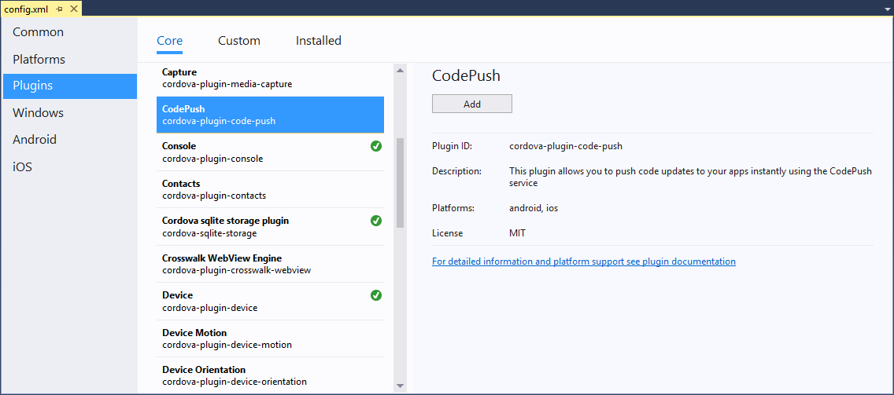

# TACO Finance: Implementing CodePush
  
## Introduction

Outside coding cross-platform mobile applications, one of the biggest problems that faces enterprise development organizations is how to quickly and easily deploy software updates to mobile devices. Many organizations implement enterprise app stores or Mobile Application Management (MAM) solutions, but those require deployment of some extra infrastructure and administrative overhead. To help solve this problem, [Microsoft created the CodePush service](https://microsoft.github.io/code-push).

Since an Ionic 2 app is essentially an Apache Cordova app, CodePush works just fine for our TACO Finance app. There’s nothing specific to the TACO Finance app in this tutorial; so the skills you learn here can be easily applied to other Ionic applications.

In this tutorial, you’ll add support for CodePush to the TACO Finance application.

## Requirements

To manage Ionic 2 application projects using Visual Studio, you will need to install the following:

+	[Visual Studio 2017](http://go.microsoft.com/fwlink/?LinkID=533794)
+	[Visual Studio Tools for Apache Cordova (TACO)](https://taco.visualstudio.com/en-us/docs/vs-taco-2017-install)
+	Visual Studio Ionic 2 Templates - Described in the [Ionic Tutorial](). 
+	Ionic Template dependencies - Described in the [Ionic Tutorial]().
+	[Google Chrome browser](https://www.google.com/chrome) (used by Visual Studio’s Simulate in Browser option).
+	[Node.js](www.nodejs.org).

Additionally, you will need to have completed [Tuturial 2: Creating the TACO Finance Application]().

## About Microsoft CodePush

CodePush is a cloud service that enables Cordova and React Native developers to deploy mobile app updates directly to their users’ devices. It works by acting as a central repository that developers can publish certain updates to (e.g. JS, HTML, CSS and image changes), and that apps can query for updates from (using our provided client SDKs). This allows you to have a more deterministic and direct engagement model with your end-users, while addressing bugs and/or adding small features that don’t require you to re-build a binary and/or re-distribute it through any public app stores.
 
## Implementing CodePush

To implement CodePush in the TACO Finance application, complete the following steps. For further reference, use the [CodePush getting started documentation](https://microsoft.github.io/code-push/docs/getting-started.html) and the [Apache Cordova application instructions](https://microsoft.github.io/code-push/docs/cordova.html#link-2).

### Install the CodePush CLI

As a developer, you’ll interact with the CodePush service through the CodePush command-line interface (CLI).

1.	The CLI uses node.js, so if you haven’t installed it already, download the latest LTS version from www.nodejs.org and install it on your development system.

2.	Install the CodePush CLI by opening a terminal window and executing the following command:

	```
	npm install -g code-push-cli
	```

	> **Note**: If you’re using a Macintosh or Linux system and you receive a permissions error when you execute the command, most documentation will tell you to prefix the command with sudo, but that’s a really bad idea for many reasons. Instead, follow the instructions at https://docs.npmjs.com/getting-started/fixing-npm-permissions to fix the permissions issue so npm will install without needing sudo.

### Create a CodePush account

To use the CodePush service, you must first register for an account.

Open a terminal window, and execute the following command:

```
code-push register
```

The CodePush CLI will open your default browser and prompt you to register with the service using one of the authentication providers shown in the following figure. Click on your provider of choice, and follow the instructions that appear to complete the process.
 

 
At the conclusion of the registration process, you’ll be given an access key to paste into the command window to complete the process. Copy the access key from the browser window and switch back to the terminal window and paste the value there. This will complete the registration process.

At this point, you’re registered and logged in to the CodePush service. You can logout of the service by executing the following command:

```
code-push logout
```

To log back into the service, execute the following command in a terminal window:

```
code-push login
```

### Register your app with the service

Before you can send updates to your app, you must first let the CodePush service know about it.

Register the app with the service using an easily remembered name. For the TACO Finance app, register it with the service using the following command: 

```
code-push app add app_name
```

Even though Ionic 2 enables you to easily build cross-platform mobile applications from a single codebase, there’s no guarantee that the exact same content is used by Android and iOS devices. Additionally, the default Cordova project in Visual Studio uses the Cordova merges capability to deliver different content to each target platform. For this reason, you’ll need to register two different applications in the CodePush service, one for Android and another for iOS. To do this, register separate versions of the app using the following commands:

```
code-push app add taco-finance-android
code-push app add taco-finance-ios
```

For each command, the CLI will respond with the following information:

```
Successfully added the "app-name" app, along with the following default deployments:

┌────────────┬───────────────────────────────────────┐
│ Name       │ Deployment Key                        │
├────────────┼───────────────────────────────────────┤
│ Production │ your_app_production_key               │
├────────────┼───────────────────────────────────────┤
│ Staging    │ your_app_staging_key                  │
└────────────┴───────────────────────────────────────┘
```

Make note of the keys (copy them somewhere) as you’ll need them later when configuring the application project for CodePush.

At this point, your CodePush account is setup and the service knows about the TACO Finance app. In the following steps, you’ll modify the app to enable you to push code updates to the app and time you have a new version.
 
### Install the Cordova Plugin

To install the CodePush plugin in the TACO Finance project, complete the following steps:

1.	In Visual Studio, open the TACO Finance App Recipe solution. When the project opens, double-click on the project’s `config.xml` file to change the project’s configuration.

2.	In the window that appears, select the **Plugins** option in the navigator.

3.	Scroll through the list of plugins and select the **CodePush** plugin.

4.	In the pane that opens, click the **Add** button to install the plugin into the project.
 
	

5.	The installation process installs two plugins, the **CodePush** plugin and its dependency, the **CodePushAcquisition** plugin, as shown below.

	 

	> **Note**: the list of installed plugins doesn't refresh automatically, so you won't see both plugins listed until you close the `config.xml` file and reopen it. 

At this point, the CodePush plugins are installed and ready to go.

### Application Configuration

**BE SURE TO REMOVE THE KEYS FROM THE PRODUCTION VERSION OF THE APPLICATION**

Next you’ll need to configure the TACO Finance app with the keys your obtained when you registered the application with the CodePush service.

1.	With the project’s `config.xml` file open in Visual Studio, press the **F7** key to switch to editing the file’s xml content directly. Visual Studio will ask you if you really want to close the file – answer yes to complete the switch.

	In the config.xml file, look for the following two sections:

	```XML
	<platform name="android">
	
	</platform>
	
	<platform name="ios">
	
	</platform>
	```

	They’ll each be full of other settings, all that matters now is that you’ve identified the sections. Add the following element to each section:

	```XML
	<preference name="CodePushDeploymentKey" value="DEPLOYMENT-KEY" />
	```

	Replacing the `DEPLOYMENT-KEY` value in each element with the deployment key you obtained when you registered the Android and iOS versions of the app. When you’re done, each platform element will contain a new `preference` element that includes your key for the specific target platform:

	```XML
	<platform name="android">
	  <preference name="CodePushDeploymentKey" value="your-android-key" />
	  <!-- other stuff -->
	
	</platform>
	
	<platform name="ios">
	  <preference name="CodePushDeploymentKey" value="your-ios-key" />
	  <!-- other stuff -->
	
	</platform>
	```

	> **Note**: The publish command we’ll use later defaults to using the Staging deployment option, so when you paste in your key, use the Staging key rather than the Production key.

	The default Cordova `config.xml` file includes the following entry:

	```XML
	<access origin="*" />
	```

	This setting enables the application to access any network endpoint. Unfortunately, this creates a security risk, so you’re expected to change this to only allow access to trusted endpoints. You can read more about this [here](https://cordova.apache.org/docs/en/latest/reference/cordova-plugin-whitelist/). If you’re restricting access in your version of the application, you’ll need to add the following allowed endpoints to the project’s config.xml file:

	```XML
	<access origin="https://codepush.azurewebsites.net" />
	<access origin="https://codepush.blob.core.windows.net" />
	<access origin="https://codepushupdates.azureedge.net" />
	```

2.	Finally, in the project’s index.html file, update the content security policy to match the following:

	```XML
	<meta http-equiv="Content-Security-Policy" content="default-src https://codepush.azurewebsites.net 'self' data: gap: https://ssl.gstatic.com https://login.windows.net https://login.microsoftonline.com https://tacoinvestmenttracker.azurewebsites.net http://dev.markitondemand.com https://api.cognitive.microsoft.com http://localhost:* ws://localhost:* 'unsafe-eval'; 'unsafe-inline'; style-src 'self' media-src *">
	```

### Update the TACO Finance App

Now that the application is all configured, it’s time to add code to the application to check for updates. 

1.	In Visual Studio, open the project's `src\app\app.component.ts` file.

2.	Ionic Native “is a curated set of ES5/ES6/TypeScript wrappers for Cordova/PhoneGap plugins that make adding any native functionality you need to your Ionic, Cordova, or Web View mobile app easy.” Ionic developers use Ionic Native to simplify using Cordova plugins in their Ionic apps. In the `imports` section at the top of the file, look for the following entry:

	```TypeScript
	import { Splashscreen, StatusBar } from 'ionic-native';
	```

	Add the CodePush component to the import statement as shown below:

	```TypeScript
	import { CodePush, Splashscreen, StatusBar } from 'ionic-native';
	```

3.	Next, in the component’s constructor, look for the following code:

	```TypeScript
	// Setup the UI, after the native app is ready
	platform.ready().then(() => {
	```

	Add the call to the CodePush service at the beginning of that block of code, immediately after the `{` shown in the example above:

	```TypeScript
	console.log('app.component.ts: Checking for updates');
	const downloadProgress = (progress) => { console.log(`CodePush: Downloaded ${progress.receivedBytes} of ${progress.totalBytes}`); }
	const syncProgress = (syncStatus) => { console.log(`CodePush: Status ${syncStatus}`); }
	CodePush.sync({}, downloadProgress).subscribe(syncProgress);
	```

With this in place, the TACO Finance application will reach out to the push service to check for updates every time the application launches. From the CodePush documentation: 

> “If an update is available, it will be silently downloaded, and installed the next time the app is restarted (either explicitly by the end user or by the OS), which ensures the least invasive experience for your end users. If an available update is mandatory, then it will be installed immediately, ensuring that the end user gets it as soon as possible.”

The `syncProgress` and `downloadProgress` functions execute when there’s the CodePush status changes and as the plugin downloads updates. You can monitor the console to see CodePush in action. When you launch the application, and there’s no update pending, you’ll see the following output in the console:

```
codePushUtil.js:36 [CodePush] Checking for update.
codePushUtil.js:36 [CodePush] Reported status: {"status":1,"label":"v7","appVersion":"0.0.1","deploymentKey":"my_deployment_key","previousLabelOrAppVersion":"v6","previousDeploymentKey":"my_deployment_key"}
codePushUtil.js:36 [CodePush] App is up to date.
main.js:97595 CodePush: Status 0
```

In the next section, you’ll see what it looks like when there’s an update to deploy.

That’s it, you’re all ready – lets test it out.

### Push Updates to the App

1.	To test the CodePush capabilities, make a visible change to the TACO Finance application and send it to the CodePush service.

	The easiest way to make a change to the application that’s visible most anywhere in the application is to open the project’s `src\providers\config.ts` file and modify the following lines:

	```TypeScript
	appNameLong = 'TACO Investment Services';
	appNameShort = 'TACO';
	```

	The contents of the `appNameLong` variable is displayed on the top of the Login page, and the `appNameShort` is displayed at the top of every page in the application.

2.	Once you’ve made a suitable change, open a terminal window and navigate to the project’s `FinanceAppIonic` folder. From here, a directory listing will show the project’s `src` and `www` folders. 

	Execute the following command to push updates to the Android version of the application:

	```
	code-push release-cordova taco-finance-android android
	```

	To push updates to the iOS version of the application, use:

	```
	code-push release-cordova taco-finance-ios ios
	```

The terminal window will whir and click for a while as the CLI processes the project and uploads the content to the CodePush service. You should see output similar to the following (with some mundane details removed) as it processes your project:

```
Running "cordova prepare" command:
No scripts found for hook "before_prepare".
Checking config.xml for saved platforms that haven't been added to the project
Checking for any plugins added to the project that have not been installed in android platform
No differences found between plugins added to project and installed in android platform. Continuing...
Generating platform-specific config.xml from defaults for android at Merging project's config.xml into platform-specific android config.xml
Merging and updating files from [www, platforms\android\platform_www] to platforms\android\assets\www
Wrote out android application name "TACO Investments" to C:\dev\TACO Finance Recipe\FinanceAppIonic\platforms\android\res\values\strings.xml
android-versionCode not found in config.xml. Generating a code based on version in config.xml (0.0.1): 1
Wrote out Android package name "com.microsoft.taco.financeappionic" to C:\dev\TACO Finance Recipe\FinanceAppIonic\platforms\android\src\com\microsoft\taco\financeappionic\MainActivity.java
Updating icons at platforms\android\res
Updating splash screens at platforms\android\res
Prepared android project successfully
No scripts found for hook "after_prepare".
Checking config.xml for saved plugins that haven't been added to the project

Releasing update contents to CodePush:

Upload progress:[==================================================] 100% 0.0s
Successfully released an update containing the "C:\ \dev\TACO Finance Recipe\FinanceAppIonic\platforms\android\assets\www" directory to the "Staging" deployment of the "taco-finance-android" app.
```

When you close and relaunch the application, you should see something similar to the following on the console:

```
[CodePush] Checking for update.
plugins/cordova-plugin-code-push/bin/www/codePushUtil.js:36 [CodePush] An update is available. {"appVersion":"0.0.1","deploymentKey":"my_deployment_key","description":"","downloadUrl":"https://codepushupdates.azureedge.net/storagev2Cb","isMandatory":false,"label":"v8","packageHash":"c2b0585","packageSize":815095,"failedInstall":false}
main.js:97595 CodePush: Status 7
plugins/cordova-plugin-code-push/bin/www/codePushUtil.js:36 [CodePush] Downloading update
main.js:97594 CodePush: Downloaded 1438 of 815095

--- Download activity deleted for brevity ---

main.js:97594 CodePush: Downloaded 815095 of 815095
plugins/cordova-plugin-code-push/bin/www/codePushUtil.js:36 [CodePush] Package download success: {"deploymentKey":"E1_5Ilvv_phRNGWHwyDh3MJuqVFdVkQ1YT6Cb","description":"","label":"v8","appVersion":"0.0.1","isMandatory":false,"packageHash":"8ec94f1c59d367d0f1a96ed07a76cf1d7098be2fde24918936988d899c2b0585","isFirstRun":false,"failedInstall":false,"localPath":"cdvfile://localhost/files/codepush/download/update.zip"}
main.js:97595 CodePush: Status 8
plugins/cordova-plugin-code-push/bin/www/codePushUtil.js:36 [CodePush] Installing update
plugins/cordova-plugin-code-push/bin/www/codePushUtil.js:36 [CodePush] Install succeeded.
plugins/cordova-plugin-code-push/bin/www/codePushUtil.js:36 [CodePush] Update is installed and will be run on the next app restart.
main.js:97595 CodePush: Status 1
```

Open the application and look for your changes. You're done!